# Tổng Quan Dự Án Token Hóa Bất Động Sản

---

## Phần 1: Tổng Quan

### Token Hóa Là Gì?

**Token hóa bất động sản** = "Chia nhỏ" quyền lợi kinh tế của BĐS thành nhiều phần bằng nhau (gọi là **token**).

**Ví dụ đơn giản:** Một căn hộ `10 tỷ VND` được chia thành `100,000 token`, mỗi token có giá `100,000 VND`. Nhà đầu tư có thể mua 10 token (`1 triệu VND`) thay vì phải mua cả căn `10 tỷ`.

| So sánh | BĐS Truyền thống | Token hóa BĐS |
|---------|------------------|---------------|
| **Vốn tối thiểu** | Hàng tỷ VND | Từ `~1 triệu VND` |
| **Thanh khoản** | 3-12 tháng để bán | Giao dịch 24/7 trên sàn |
| **Minh bạch** | Phụ thuộc bên bán | Ghi nhận trên blockchain |
| **Quản lý** | Tự quản lý hoặc ủy thác | Hoàn toàn tự động |

#### Ai Sở Hữu Tài Sản?

| Loại quyền | Ai nắm giữ? | Giải thích |
|------------|-------------|------------|
| **Quyền lợi kinh tế** | Nhà đầu tư (giữ token) | Được hưởng lợi nhuận khi BĐS tăng giá hoặc thanh lý |
| **Quyền sở hữu pháp lý** (Sổ đỏ) | SPV02 (Pháp nhân chuyên biệt) | Đứng tên trên giấy tờ nhà đất, thay mặt nhà đầu tư |

Nhà đầu tư muốn **lấy sổ đỏ** → Thực hiện **Redemption** (đổi đủ số token tương ứng giá trị căn hộ để nhận sổ đỏ)

---

### Xu Hướng Tài Sản Mã Hóa (RWA)

#### Tổng Quan Các Xu Hướng

| Xu hướng | Mô tả | Trên thế giới | Tại Việt Nam | Đối với Vingroup |
|----------|-------|---------------|--------------|------------------|
| **Stablecoin** | Đồng tiền mã hóa ổn định | Đang phát triển mạnh | Chưa có khung pháp lý | Không phù hợp |
| **CEX** | Sàn giao dịch tập trung | Thị trường lớn | Đang phát triển | Hợp tác với CEX |
| **RWA - Tín dụng tư nhân** | Mã hóa quỹ cho vay | `$14B+` đã số hóa<br/>Lãi suất: `8-12%`/năm | Cơ sở hạ tầng hạn chế | Không phù hợp |
| **RWA - Trái phiếu Chính phủ** | Số hóa trái phiếu Kho bạc | `$8B+` đã số hóa<br/>BlackRock BUIDL: `$2.8B` | Chưa được số hóa | Không phù hợp |
| **RWA - Cổ phiếu công khai** | Giao dịch cổ phiếu 24/7 | Nhiều đơn vị ngừng hoạt động | Thanh khoản cao, không cần số hóa | Không phù hợp |
| **RWA - Cổ phiếu tư nhân** | Thanh khoản cổ phần pre-IPO | `<$660M` đã mã hóa | Ưu tiên IPO truyền thống | Chưa phù hợp |
| **RWA - Trái phiếu doanh nghiệp** | Số hóa chứng khoán nợ | `$261M` đã mã hóa | Tiềm năng cho thanh khoản | Phù hợp để cân nhắc |
| **RWA - BĐS** | Sở hữu phân mảnh BĐS | `$300M-$500M`<br/>RealT: `$133M` | Phù hợp văn hóa đầu tư | **Rất phù hợp** |

#### Khuyến Nghị Cho Vingroup

- **Rất phù hợp cho BĐS**: Vingroup có danh mục tài sản BĐS hàng đầu Việt Nam, có niềm tin lớn từ thị trường
- **Phù hợp để cân nhắc đối với trái phiếu**: Đặc biệt đối với những dự án cần huy động vốn lớn mà hạn mức tín dụng không còn nhiều như dự án hạ tầng, năng lượng
- **Phù hợp để cân nhắc đối với tài sản mới**: Đặc biệt là năng lượng xanh
- **Khuyến nghị**: Xây dựng một Nền tảng Mã hóa Tài sản (Tokenization Platform), tập trung vào mã hóa BĐS, các tài sản mới liên quan đến năng lượng, và một số trái phiếu chọn lọc

---

## Phần 2: Mô Hình Vận Hành

### Cấu Trúc Pháp Nhân

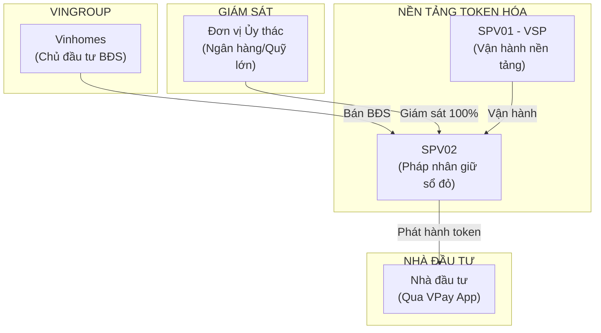

#### Các Bên Tham Gia

| Vai trò | Tiếng Việt | Đơn vị | Trách nhiệm |
|---------|------------|--------|-------------|
| **AO** | Chủ sở hữu tài sản gốc | Vinhomes | Xây dựng BĐS, bán cho SPV02 để token hóa |
| **SPV01** | Đơn vị vận hành nền tảng | VSP (Polaris) | Vận hành công nghệ, quản lý vòng đời token |
| **SPV02** | Pháp nhân nắm giữ BĐS | Pháp nhân riêng | **Giữ sổ đỏ** thay mặt nhà đầu tư |
| **Trustee** | Đơn vị ủy thác | Ngân hàng/Quỹ lớn | Giám sát SPV02, bảo vệ quyền lợi nhà đầu tư |
| **INV** | Nhà đầu tư | Cá nhân/Tổ chức | Mua token qua VPay App |

#### Vai Trò Của SPV02 - Pháp Nhân Giữ Sổ Đỏ

SPV02 là **trung tâm** của mô hình, đóng vai trò:

- **Nắm giữ quyền sở hữu pháp lý** (sổ đỏ) của tất cả BĐS trong pool
- **Tách biệt hoàn toàn** với Vinhomes và VSP → Bảo vệ nhà đầu tư nếu một bên gặp vấn đề
- **Được giám sát** bởi Đơn vị ủy thác (Trustee) - ngân hàng hoặc quỹ đầu tư lớn
- **Không thể tự ý** bán hoặc chuyển nhượng BĐS mà không có sự đồng ý của Trustee

#### Dòng Tiền Và Tài Sản

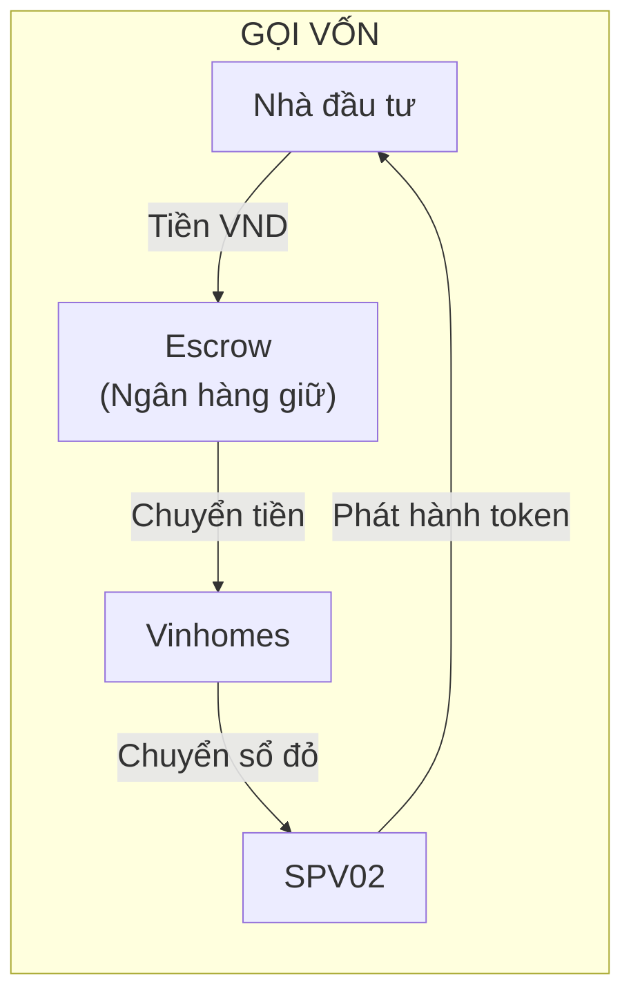

---

### Quy Trình Token Hóa Tài Sản

#### Tổng Quan 6 Bước

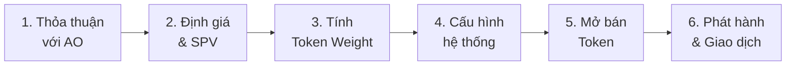

#### Bước 1: Thỏa Thuận Mua Tài Sản Từ AO

**AO (Asset Originator)** = Chủ sở hữu tài sản gốc (VD: Vinhomes)

**Nội dung thỏa thuận:**
- `AO` (Vinhomes) đề xuất dự án BĐS cho `SPV01` (nền tảng token hóa)
- Hai bên ký **Thỏa thuận liên kết đầu tư** bao gồm:
  - Danh sách BĐS: VD: **100 căn hộ** trong dự án
  - Giá trị từng căn: `AO.PROPERTY[i].VALUE`
  - Tổng giá trị dự án: `AO.ESTATE_PROJECT.TOTAL_VALUE`
  - ICO margin (chênh lệch giữa giá mua từ AO và giá bán token)
  - Nghĩa vụ các bên (bảo lãnh xây dựng, bàn giao...)

**Ví dụ cụ thể:**

| Loại BĐS | Số lượng | Giá/căn | Tổng giá trị |
|----------|----------|---------|--------------|
| Chung cư Type A | 50 căn | `8 tỷ VND` | `400 tỷ VND` |
| Chung cư Type B | 30 căn | `12 tỷ VND` | `360 tỷ VND` |
| Biệt thự Type C | 20 căn | `24 tỷ VND` | `480 tỷ VND` |
| **Tổng** | **100 căn** | | **`1,240 tỷ VND`** |

---

#### Bước 2: Định Giá Độc Lập & Thành Lập SPV

**Định giá:**
- Công ty định giá độc lập (CBRE, Savills, JLL) xác định giá trị từng căn
- Kết quả: `AO.PROPERTY.VALUE` cho mỗi căn, công khai cho nhà đầu tư

**Thành lập SPV02:**
- Tạo pháp nhân riêng biệt để giữ sổ đỏ
- Bổ nhiệm Trustee (ngân hàng/quỹ lớn) giám sát
- AO chuyển nhượng BĐS cho SPV02

---

#### Bước 3: Tính Token Weight Cho Từng Căn

**Công thức:**
```
Token Weight = Giá trị căn hộ / Giá token
             = AO.PROPERTY[i].VALUE / SPV01.TOKEN.PRICE
```

**Quy tắc quan trọng:**
- Token weight **cố định** từ khi thiết lập → không thay đổi trong suốt TOKO/OSET
- Sau OSET, SPV02 có thể đề xuất điều chỉnh tỷ lệ nếu giá BĐS thay đổi (cần NĐT đồng ý)

**Ví dụ với giá token `100K VND`:**

| Loại BĐS | Giá/căn | Token Weight/căn | Số căn | Tổng token |
|----------|---------|------------------|--------|------------|
| Type A | `8 tỷ` | `80,000 token` | 50 | `4,000,000` |
| Type B | `12 tỷ` | `120,000 token` | 30 | `3,600,000` |
| Type C | `24 tỷ` | `240,000 token` | 20 | `4,800,000` |
| **Tổng** | | | **100 căn** | **`12,400,000 token`** |

**Ý nghĩa:** Để redemption (đổi token lấy sổ đỏ) căn Type C, NĐT cần giữ `240,000 token`

---

#### Bước 4: Cấu Hình Hệ Thống

- Thiết lập smart contract trên blockchain
- Cấu hình quy tắc: lock-up `90 ngày`, giới hạn giao dịch, KYC bắt buộc
- Kiểm toán bảo mật bởi bên thứ ba
- Upload tài liệu: Offering Memorandum, Legal Opinion, Valuation Report

---

#### Bước 5: Mở Bán Token (Token Offering)

- Công bố thông tin 7 ngày trước khi mở bán
- Nhà đầu tư đăng ký mua qua VPay App
- Tiền được giữ trong Escrow (ngân hàng) - không phải SPV

---

#### Bước 6: Phát Hành Và Giao Dịch

| Kết quả huy động | Xử lý |
|------------------|-------|
| **Không đạt** (`<70%` mục tiêu) | Hủy đợt phát hành, **hoàn tiền 100%** cho nhà đầu tư |
| **Đạt mục tiêu** (`70-100%`) | Phát hành token, chuyển tiền cho AO. Token chưa bán được trả về kho dự trữ |
| **Vượt mục tiêu** (`>100%`) | Phân bổ theo tỷ lệ (pro-rata), **hoàn tiền phần dư** |

**Ví dụ vượt mục tiêu (Oversubscription):**
- Mục tiêu huy động: `1,240 tỷ VND`
- Thực tế đăng ký: `1,736 tỷ VND` (vượt `140%`)
- Tỷ lệ phân bổ: `1,240/1,736 = 71.4%`
- Nhà đầu tư đăng ký `100 triệu` → Được phân bổ `71.4 triệu` token, hoàn lại `28.6 triệu` tiền mặt

Sau lock-up (`90 ngày`): Token được giao dịch trên sàn CEX

---

### Quy Trình Đầu Tư Cho Nhà Đầu Tư

#### Tổng Quan Vòng Đời Đầu Tư

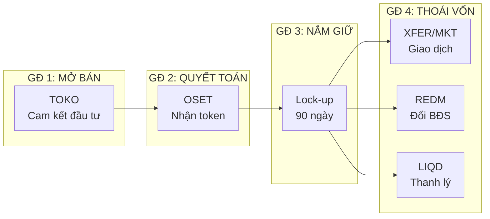

| Giai đoạn | Mô tả | Thời gian |
|-----------|-------|-----------|
| **GĐ 1: Mở bán (TOKO)** | NĐT cam kết đầu tư, tiền được VPay hold | 30-90 ngày |
| **GĐ 2: Quyết toán (OSET)** | Phân bổ token, chuyển tiền cho Vinhomes | T+0 đến T+2 |
| **GĐ 3: Nắm giữ (Hold)** | Lock-up, không giao dịch | 90 ngày |
| **GĐ 4: Thoái vốn (Exit)** | Giao dịch CEX, đổi BĐS, hoặc thanh lý | Sau lock-up |

---

#### Giai Đoạn 1: Mở Bán Token (TOKO)

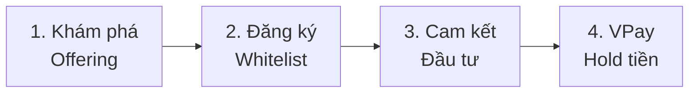

| Bước | Hành động | Mô tả |
|------|-----------|-------|
| **1. Khám phá** | NĐT tìm hiểu Token Offering | Xem thông tin dự án, tài liệu (Offering Memorandum), định giá BĐS |
| **2. Đăng ký Whitelist** | NĐT hoàn thành KYC | Xác minh danh tính qua eKYC, đồng ý điều khoản đầu tư |
| **3. Cam kết đầu tư** | NĐT chọn số tiền đầu tư | Nhập số tiền (tối thiểu/tối đa theo quy định), xác nhận biometric |
| **4. VPay hold tiền** | Tiền được giữ trong VPay | Tiền **chưa chuyển** cho Vinhomes, NĐT có thể **hủy/điều chỉnh** trước deadline |

---

#### Giai Đoạn 2: Quyết Toán (OSET)

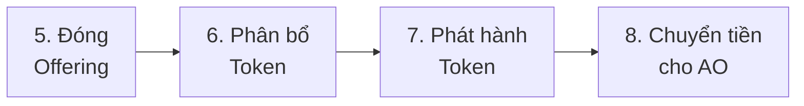

| Bước | Hành động | Chi tiết |
|------|-----------|----------|
| **5. Đóng Offering** | Hết thời gian mở bán | Hệ thống khóa, không nhận thêm cam kết mới |
| **6. Phân bổ Token** | Tính toán phân bổ | Dựa vào kết quả huy động (xem bảng bên dưới) |
| **7. Phát hành Token** | Mint token cho NĐT | Smart contract tạo token, gửi vào ví NĐT |
| **8. Chuyển tiền cho AO** | Capture tiền từ Escrow | Tiền chuyển từ Escrow → Vinhomes (AO) |

**Kết quả quyết toán theo mức huy động:**

| Kịch bản | Điều kiện | Xử lý tiền | Xử lý token |
|----------|-----------|------------|-------------|
| **Thất bại** | `<70%` soft cap | **Hoàn 100%** tiền cho NĐT | Không phát hành |
| **Thành công** | `≥70%` | Chuyển cho Vinhomes | Mint theo cam kết |
| **Vượt mức** | `>100%` | Chuyển 100% mục tiêu, **hoàn tiền dư** | Mint theo tỷ lệ (pro-rata) |

---

#### Giai Đoạn 3: Nắm Giữ (Lock-up & Vesting)

**Lock-up Period** = Thời gian khóa giao dịch sau khi nhận token

| Thông số | Giá trị | Ghi chú |
|----------|---------|---------|
| **Thời gian lock-up** | `90 ngày` sau settlement | Cấu hình được theo dự án |
| **Áp dụng cho** | Giao dịch CEX, yêu cầu Redemption | Không áp dụng cho việc xem portfolio |

**Vesting Schedule** (Tùy chọn):

| Loại Vesting | Mô tả |
|--------------|-------|
| **Không có vesting** | 100% token khả dụng ngay sau lock-up `90 ngày` |
| **Linear vesting 1 năm** | 25% mở khóa mỗi 3 tháng |
| **Cliff + vesting** | 0% trong 6 tháng đầu, sau đó 50% mỗi 3 tháng |

---

#### Giai Đoạn 4: Thoái Vốn (Exit Options)

Sau khi hết lock-up, NĐT có 3 lựa chọn thoái vốn:

| Lựa chọn | Mô tả | Khi nào sử dụng |
|----------|-------|-----------------|
| **XFER/MKT** | Chuyển token ra CEX và giao dịch | Muốn bán token lấy tiền mặt |
| **REDM** | Đổi token lấy BĐS thực | Đủ token cho 1 căn, muốn sở hữu BĐS |
| **LIQD** | Nhận tiền khi dự án thanh lý | Khi SPV02 bán toàn bộ BĐS |

---

##### Lựa chọn 1: Giao Dịch Token (XFER → MKT)

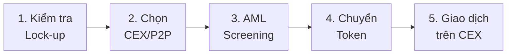

| Bước | Chi tiết |
|------|----------|
| **1-4. Chuyển token (XFER)** | Kiểm tra lock-up → Chọn CEX/P2P → AML → Chuyển token |
| **5. Giao dịch (MKT)** | Mua bán token 24/7 trên sàn CEX |

---

##### Lựa chọn 2: Đổi Token Lấy BĐS (REDM)

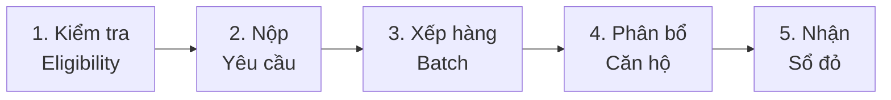

**Điều kiện:**
- Đủ Token Weight của loại căn hộ muốn đổi (VD: `80,000 token` cho căn Type A)
- Đã qua lock-up (`90 ngày`) và vesting (nếu có)
- Hoàn thành KYC

**Quy trình:**
- Nộp yêu cầu + đặt cọc (phí VSP `~2%` + thuế chuyển nhượng)
- Xếp hàng theo batch (VD: mỗi 2 tháng)
- Phân bổ căn hộ **random** (chống cherry-picking)
- Hoàn tất pháp lý → Nhận sổ đỏ, token bị **burn**

---

##### Lựa chọn 3: Thanh Lý Dự Án (LIQD)

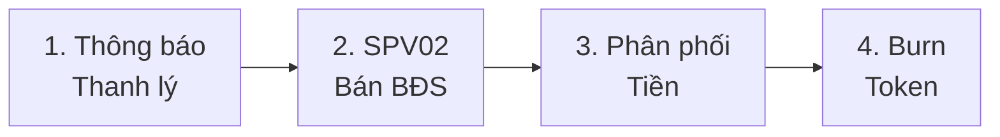

**Quy trình:**
- SPV02 công bố thanh lý → Bán BĐS trên thị trường
- Trừ phí VSP (`~5%`) → Chia tiền theo tỷ lệ token
- Tiền VND vào VPay → Token bị **burn**, dự án kết thúc

---

### Dòng Tiền & Tài Sản

#### Sơ Đồ Dòng Tiền Khi Quyết Toán Thành Công

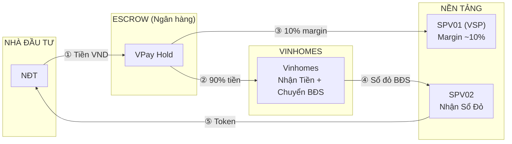

**Giải thích:**
- **① NĐT → Escrow**: Tiền cam kết được hold trong VPay suốt giai đoạn TOKO
- **② Escrow → Vinhomes**: `~90%` tiền huy động chuyển cho Vinhomes để mua BĐS
- **③ Escrow → VSP**: `~10%` tiền giữ lại làm ICO Margin cho nền tảng
- **④ Vinhomes → SPV02**: Sổ đỏ BĐS được chuyển nhượng cho SPV02
- **⑤ SPV02 → NĐT**: Token được mint và gửi vào ví của nhà đầu tư

---

#### Ví Dụ Cụ Thể: Đợt Phát Hành 1,240 Tỷ VND

**Bối cảnh:**
- Mục tiêu huy động: `1,240 tỷ VND` (100 căn hộ)
- Thực tế cam kết: `1,488 tỷ VND` (vượt `120%`)
- NĐT A cam kết: `100 triệu VND`

**Kết quả quyết toán:**

| Khoản mục | Số tiền | Ghi chú |
|-----------|---------|---------|
| Tổng cam kết | `1,488 tỷ VND` | Vượt `120%` mục tiêu |
| Tiền capture | `1,240 tỷ VND` | `100%` mục tiêu |
| Tiền hoàn lại (tổng) | `248 tỷ VND` | `20%` vượt mức |
| → Chuyển cho Vinhomes | `~1,127 tỷ VND` | `~90%` của capture |
| → Giữ lại VSP (margin) | `~113 tỷ VND` | `~10%` của capture |

**Kết quả cho NĐT A:**

| Khoản mục | Giá trị | Ghi chú |
|-----------|---------|---------|
| Cam kết ban đầu | `100 triệu VND` | |
| Tỷ lệ phân bổ | `83.3%` | `1,240/1,488` |
| Tiền được capture | `83.3 triệu VND` | Đổi lấy token |
| Tiền hoàn lại | `16.7 triệu VND` | Tự động hoàn về VPay |
| **Token nhận được** | **`833 token`** | Với giá `100K VND`/token |

---

### Quyền Sở Hữu Và Quyền Lợi

#### Phân Biệt Quyền Sở Hữu

| Loại quyền | Ai nắm giữ? | Nội dung |
|------------|-------------|----------|
| **Quyền sở hữu pháp lý** (Sổ đỏ) | SPV02 | Đứng tên trên giấy tờ nhà đất |
| **Quyền lợi kinh tế** (Token) | Nhà đầu tư | Được hưởng lợi nhuận từ BĐS |

#### Nhà Đầu Tư Được Gì?

| Quyền | Mô tả |
|-------|-------|
| **Giao dịch** | Mua bán token 24/7 trên sàn giao dịch |
| **Redemption** | Đổi token lấy căn hộ thật (khi đủ số lượng) |
| **Liquidation** | Nhận tiền khi dự án thanh lý |
| **Biểu quyết** | Tham gia quyết định quan trọng (thay đổi Trustee, thanh lý sớm) |

#### Redemption - Đổi Token Lấy Sổ Đỏ

**Điều kiện:**
- Giữ đủ số token tương ứng với giá trị căn hộ
- Đã qua thời gian lock-up (`90 ngày`)
- Hoàn thành xác minh danh tính (KYC)

**Quy trình:**
1. Nhà đầu tư đặt yêu cầu đổi token
2. Đặt cọc tiền (phí + thuế chuyển nhượng)
3. Hệ thống phân bổ căn hộ theo cơ chế random (công bằng)
4. Hoàn tất thủ tục pháp lý → Nhận sổ đỏ
5. Token bị burn (hủy) tương ứng

---

### Cơ Chế Bảo Vệ Nhà Đầu Tư

#### Bảo Vệ Đa Lớp

| Lớp | Cơ chế | Mô tả |
|-----|--------|-------|
| **Pháp lý** | Trustee giám sát | Đơn vị ủy thác nắm `100%` cổ phần SPV02, bảo vệ quyền lợi nhà đầu tư |
| **Tài chính** | Escrow | Tiền đầu tư được ngân hàng thứ ba giữ, hoàn trả nếu không đạt mục tiêu |
| **Kỹ thuật** | Smart Contract | Quy trình tự động trên blockchain, không thể can thiệp |
| **Vận hành** | Lock-up | `90 ngày` đầu không thể bán → ngăn bán tháo |

#### Bảo Lãnh Xây Dựng

- Vinhomes **cam kết** hoàn thành xây dựng theo tiến độ
- Nếu chậm trễ hoặc thất bại:
  - Nhà đầu tư được **bảo đảm tối thiểu**: Giá ICO + lãi suất ngân hàng
  - Có thể đổi sang sản phẩm khác của Vingroup
  - Hoặc nhận tiền hoàn trả

---

## Phần 3: Kinh Doanh & Triển Khai

### Mô Hình Kinh Doanh

#### Nguồn Doanh Thu Chính

| # | Nguồn thu | Phát sinh tại | Mức phí | Chi tiết |
|---|-----------|---------------|---------|----------|
| 1 | **Phí phát hành (ICO Margin)** | [GĐ 2: Quyết Toán (OSET)](#giai-đoạn-2-quyết-toán-oset) | `~10%` giá trị BĐS | Chênh lệch giữa giá mua từ AO và giá bán token |
| 2 | **Phí Redemption** | [Lựa chọn 2: Đổi Token Lấy BĐS](#lựa-chọn-2-đổi-token-lấy-bđs-redm) | `0-2%` giá trị căn | Giảm dần theo thời gian giữ token |
| 3 | **Phí Liquidation** | [Lựa chọn 3: Thanh Lý Dự Án](#lựa-chọn-3-thanh-lý-dự-án-liqd) | `~5%` tiền bán BĐS | Trừ từ tiền bán trước khi chia |

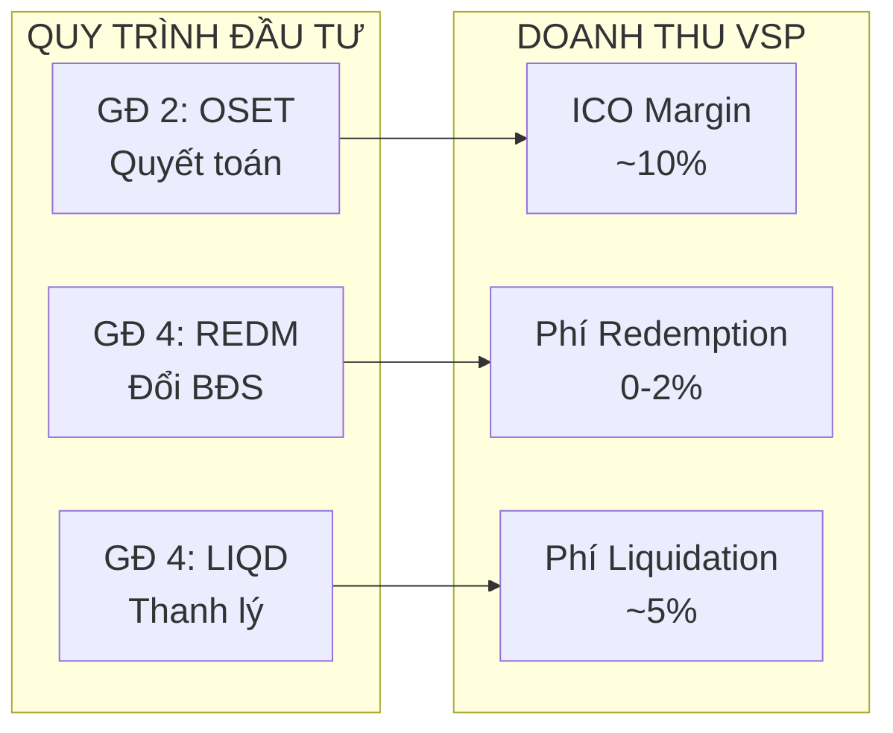

---

#### Chi Tiết Từng Nguồn Thu

##### 1. Phí Phát Hành (ICO Margin)

**Phát sinh tại:** [Giai Đoạn 2: Quyết Toán (OSET)](#giai-đoạn-2-quyết-toán-oset) → Bước 8: Chuyển tiền cho AO

| Khoản mục | Giá trị | Ghi chú |
|-----------|---------|---------|
| Giá mua BĐS từ Vinhomes | `~90%` giá bán token | Giá gốc từ AO |
| Giá bán token cho NĐT | `100%` | Giá công bố |
| **ICO Margin (VSP giữ lại)** | **`~10%`** | Chênh lệch |

**Ví dụ:** Đợt phát hành `500 tỷ VND`
- Giá mua từ Vinhomes: `~455 tỷ VND`
- Giá bán token: `500 tỷ VND`
- **Doanh thu VSP: `~45 tỷ VND`**

---

##### 2. Phí Redemption

**Phát sinh tại:** [Lựa chọn 2: Đổi Token Lấy BĐS (REDM)](#lựa-chọn-2-đổi-token-lấy-bđs-redm) → Bước 2: Nộp yêu cầu + đặt cọc

| Thời gian giữ token | Phí VSP | Lý do |
|---------------------|---------|-------|
| 0–12 tháng | `~2%` giá trị căn | Khuyến khích giữ lâu |
| 12–24 tháng | `~1%` | Giảm dần |
| Trên 24 tháng | `0%` | Miễn phí |

**Ví dụ:** NĐT đổi căn `8 tỷ VND` sau 6 tháng
- Phí VSP (`2%`): `160 triệu VND`
- Thuế chuyển nhượng: Theo quy định

*Mục đích: Khuyến khích giao dịch token trên sàn thay vì đổi BĐS sớm → Duy trì thanh khoản*

---

##### 3. Phí Liquidation

**Phát sinh tại:** [Lựa chọn 3: Thanh Lý Dự Án (LIQD)](#lựa-chọn-3-thanh-lý-dự-án-liqd) → Bước 3: Phân phối tiền

| Khoản mục | Giá trị |
|-----------|---------|
| Tiền bán BĐS | `100%` |
| Phí VSP | `~5%` |
| Chia cho NĐT | `~95%` |

**Ví dụ:** Thanh lý dự án `500 tỷ VND`
- Phí VSP (`5%`): `25 tỷ VND`
- Chia cho NĐT: `475 tỷ VND`

---

#### Tổng Hợp Doanh Thu Nền Tảng

| Nguồn thu | Mức phí | Quy trình liên quan |
|-----------|---------|---------------------|
| **Phí mã hóa tài sản** | `2%-20%` | [Bước 1-4: Token Hóa Tài Sản](#quy-trình-token-hóa-tài-sản) |
| **Phí giao dịch phát hành** | `0.5%` | [GĐ 1: Mở Bán (TOKO)](#giai-đoạn-1-mở-bán-token-toko) |
| **Phí nền tảng hàng năm** | `0.5%` | [GĐ 3: Nắm Giữ](#giai-đoạn-3-nắm-giữ-lock-up--vesting) |
| **Chênh lệch Market maker** | `1%` | [Lựa chọn 1: Giao Dịch Token](#lựa-chọn-1-giao-dịch-token-xfer--mkt) |
| **Dịch vụ thế chấp** | `1.5%` + `10%`/năm | Dịch vụ tùy chọn |
| **Quản lý BĐS** | Theo thỏa thuận | Dịch vụ tùy chọn |

---

### Lộ Trình Triển Khai Và Khung Pháp Lý

#### Tổng Quan Lộ Trình

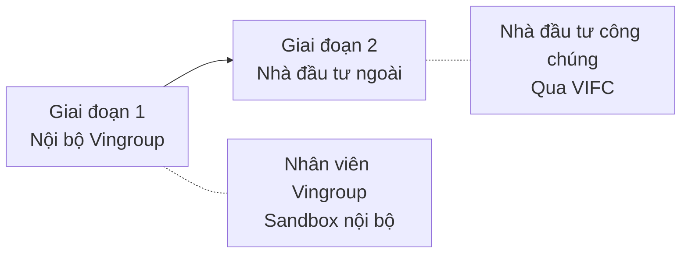

#### Giai Đoạn 1: Mở Bán Nội Bộ (Pilot)

**Đối tượng:** Nhân viên Vingroup

**Mục tiêu:**
- Thử nghiệm sản phẩm trong môi trường kiểm soát
- Thu thập phản hồi, cải thiện trải nghiệm
- Chứng minh mô hình hoạt động trước khi mở rộng

**Vấn đề pháp lý:**
- **Hiện trạng**: Việt Nam chưa có khung pháp lý rõ ràng cho token hóa BĐS
- **Giải pháp**: Triển khai dưới dạng **sandbox nội bộ** - giới hạn trong nhân viên Vingroup
- **Rủi ro**: Thấp do phạm vi hẹp và đối tượng là nhân viên nội bộ

#### Giai Đoạn 2: Mở Bán Cho Nhà Đầu Tư Bên Ngoài

**Đối tượng:** Nhà đầu tư công chúng (trong nước và quốc tế)

**Vấn đề pháp lý chính:**

| Vấn đề | Mô tả | Giải pháp |
|--------|-------|-----------|
| **Nhà đầu tư trong nước** | Pháp luật VN chưa cho phép cá nhân trong nước đầu tư trực tiếp vào token BĐS | Đầu tư **gián tiếp qua VIFC** (Vingroup Investment Fund Company) |
| **Khung pháp lý** | Chưa có luật về sở hữu phân đoạn BĐS | Áp dụng khung **Sandbox Bộ Tài chính** |
| **Giám sát** | Cần có cơ quan giám sát độc lập | **Ủy ban Chứng khoán** giám sát theo luật chứng khoán |

#### Cơ Chế Đầu Tư Qua VIFC

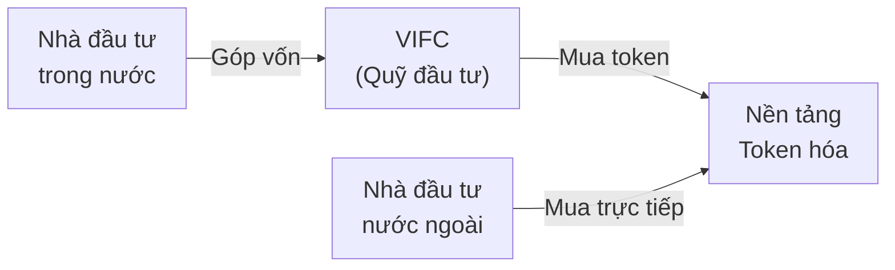

**Tại sao cần qua VIFC?**
- Pháp luật hiện hành **chưa cho phép** cá nhân trong nước đầu tư trực tiếp vào tài sản số
- VIFC đóng vai trò **"cầu nối pháp lý"** - nhà đầu tư góp vốn vào quỹ, quỹ mua token
- Khi khung pháp lý hoàn thiện → Chuyển sang đầu tư trực tiếp

#### Sandbox Bộ Tài Chính

**Sandbox là gì?**
- Môi trường thử nghiệm có kiểm soát do Bộ Tài chính cấp phép
- Cho phép triển khai sản phẩm tài chính mới trong phạm vi giới hạn
- Có giám sát chặt chẽ và báo cáo định kỳ

**Lợi ích:**
- Hợp pháp hóa hoạt động trong khi chờ luật chính thức
- Tạo tiền đề cho việc xây dựng khung pháp lý
- Giảm rủi ro pháp lý cho các bên tham gia

---

### Lộ Trình Triển Khai Chi Tiết

#### Giai Đoạn 1: Xây Dựng Nền Tảng (6-12 tháng)

**Tham gia quy định:**
- Tham vấn với SBV, SSC, MOJ về phát triển khung pháp lý
- Thiết kế cấu trúc pháp lý tuân thủ VN với công ty luật hàng đầu
- Mang chuyên gia quốc tế từ các thị trường RWA thành công (Thái Lan, Singapore)
- Nộp đề xuất chương trình thí điểm chi tiết
- Thành lập liên minh ngành với các công ty fintech/PropTech

**Phát triển công nghệ:**
- Kiến trúc nền tảng token hóa an toàn, có thể mở rộng
- Phát triển smart contract với tính năng tuân thủ VN
- Nhiều cuộc kiểm toán bảo mật độc lập
- Chuẩn bị tích hợp sàn giao dịch và hệ thống ngân hàng
- Ứng dụng di động thân thiện người dùng

---

#### Giai Đoạn 2: Thực Hiện Thí Điểm (12-18 tháng)

**Ra mắt hạn chế:**
- Token hóa 1 BĐS chất lượng cao đầu tiên
- Nhắm mục tiêu nhà đầu tư tổ chức (ngân hàng, bảo hiểm, quỹ hưu trí)
- Quy mô phát hành nhỏ: `$5-10 triệu USD` để thử nghiệm
- Hệ sinh thái đầy đủ: Trustee, kiểm toán, quản lý BĐS
- Chứng minh tuân thủ đầy đủ tất cả luật áp dụng

**Phát triển thị trường:**
- Chiến dịch giáo dục nhà đầu tư toàn diện
- Đào tạo cố vấn tài chính, quản lý tài sản
- Xây dựng nhận thức qua báo chí tài chính
- Phát triển quan hệ đối tác với nhà phát triển BĐS
- Tinh chỉnh nền tảng dựa trên phản hồi người dùng

---

#### Giai Đoạn 3: Mở Rộng Thị Trường (18-36 tháng)

**Mở rộng quy mô:**
- Token hóa 5-10 BĐS
- Phát hành lớn hơn: `$50-100 triệu USD`/BĐS
- Mở cho nhà đầu tư cá nhân đủ điều kiện
- Ra mắt thị trường thứ cấp với nhà tạo lập thanh khoản
- Mở rộng địa lý: Nhiều thành phố

**Phát triển hệ sinh thái:**
- Mở rộng mạng lưới nhà cung cấp dịch vụ
- Giúp thiết lập tiêu chuẩn ngành
- Hỗ trợ phát triển quy định RWA toàn diện
- Khám phá cơ hội khu vực ASEAN
- Phát triển loại tài sản mới ngoài BĐS

---

#### Chỉ Số Thành Công

| Giai đoạn | Mục tiêu | Tiêu chí thành công |
|-----------|----------|---------------------|
| **GĐ1** | Phê duyệt quy định, nền tảng hoạt động | Sự ủng hộ chính phủ |
| **GĐ2** | `$10M+` token hóa, `100+` NĐT | Thí điểm thành công, NĐT quan tâm |
| **GĐ3** | `$100M+` token hóa, `1000+` NĐT | Thị trường thiết lập, giao dịch thứ cấp |
| **Dài hạn** | `$1B+` thị trường, nhiều loại tài sản | Dẫn đầu ngành, khung quy định hoàn thiện |

---

#### Chiến Lược Đối Tác

**Tổ chức tài chính:**
- **Trustee**: VCB, CTG, BIDV
- **Bảo hiểm**: Bảo Việt, PVI
- **Quản lý tài sản**: VinaCapital, Dragon Capital
- **Chứng khoán**: HSC, VPS

**Đối tác BĐS:**
- **Nhà phát triển**: Vingroup, Novaland, Hưng Thịnh
- **Quản lý**: CBRE Vietnam, Savills
- **Định giá**: Knight Frank, Colliers
- **Pháp lý**: Baker McKenzie Vietnam, Freshfields

---

#### Kế Hoạch Giảm Thiểu Rủi Ro

**Rủi ro quy định:**
- Tham vấn mở rộng trước khi ra mắt (pre-approval strategy)
- Nhiều tùy chọn cấu trúc pháp lý sẵn sàng
- Xây dựng hỗ trợ từ nhiều bên liên quan
- Tuân thủ vượt quá yêu cầu tối thiểu (compliance over-engineering)

**Rủi ro thị trường:**
- Bắt đầu quy mô nhỏ, mở rộng dần (conservative sizing)
- Chỉ BĐS cao cấp ban đầu (quality focus)
- Đối tác tổ chức mạnh (professional backing)
- Chương trình giáo dục nhà đầu tư toàn diện

**Rủi ro công nghệ:**
- Sử dụng hạ tầng blockchain đã được kiểm chứng
- Nhiều cuộc kiểm toán bảo mật, bảo hiểm
- Hệ thống backup và quy trình khẩn cấp
- Giám sát bảo mật và hiệu suất 24/7

---

### Công Nghệ Sử Dụng

#### Tổng Quan Công Nghệ

| Công nghệ | Vai trò |
|-----------|---------|
| **Blockchain** | Sổ cái số minh bạch, không thể sửa đổi |
| **Smart Contract** | Hợp đồng tự động thực thi |
| **eKYC/AML** | Xác minh danh tính, chống rửa tiền |
| **VPay** | Ví điện tử cho nhà đầu tư |

#### Tiêu Chuẩn Áp Dụng

- **ERC-3643**: Tiêu chuẩn security token quốc tế
- **Arbitrum**: Mạng blockchain Layer 2 (nhanh, chi phí thấp)
- **On-chain Identity**: Danh tính xác minh lưu trên blockchain

---

## Phần 4: Phân Tích So Sánh

### So Sánh Với Mô Hình VMI (Mua Chung BĐS)

#### Mô Hình VMI Hiện Tại

**Cấu trúc sản phẩm:**
- Mỗi BĐS chia thành **50 phần đầu tư** tương ứng với giá trị BĐS xác định theo giá bán lẻ của CĐT
- Nhà đầu tư nhận **CNQTS** (Chứng Nhận Quyền Tài Sản) do VMI xác nhận
- VMI đứng tên sở hữu BĐS, NĐT chỉ có quyền lợi kinh tế

**Chính sách lợi nhuận VMI:**

| Điều kiện | Lợi nhuận |
|-----------|-----------|
| Giữ 3 năm | `9.5%`/năm |
| Rút sớm sau 18 tháng | `7.5%`/năm |
| Rút trước 18 tháng | Không được rút |
| Sau 5 năm chưa bán được BĐS | VMI mua lại với `7%`/năm |
| Giá bán kỳ vọng | `15%`/năm |

**Quy trình giao dịch VMI:**
- **Sơ cấp**: NĐT đăng ký đầu tư → Góp tiền qua VMI → Ký TĐĐT → Nhận CNQTS
- **Thứ cấp**: NĐT chuyển nhượng CNQTS → VMI xác nhận → Không thu phí

---

#### Nguyên Nhân VMI Thiếu Thanh Khoản

**Vấn đề gốc rễ - Thiếu khung pháp lý:**

| Yếu tố | Thị trường quốc tế | Việt Nam (VMI) |
|--------|-------------------|----------------|
| **Luật sở hữu phân mảnh** | Có luật sở hữu 1 phần nhà | Không có luật |
| **Giá trị phần sở hữu** | Tăng/giảm theo giá thực tế BĐS | Cố định theo lãi suất SP tài chính |
| **Nhu cầu giao dịch** | Có demand trade (như chứng khoán) | Không có demand trade |
| **Sàn giao dịch** | Có sàn, có thanh khoản | Có sàn nhưng gần như không giao dịch |

**Các kênh đầu tư cạnh tranh tại VN:**
- Trái phiếu: `8-10%`/năm, được rút trước đáo hạn
- Vàng: Tăng giá mạnh
- Ngân hàng: Sản phẩm sinh lời tự động
- Cổ phiếu: VNIndex tăng trưởng

**Kết luận:** VMI không hấp dẫn vì:
- Dù giá nhà tăng, NĐT chỉ nhận lãi suất cố định
- Thiếu pháp lý → không có khám phá giá thực → không có nhu cầu trade
- Thanh khoản kém dù có sàn giao dịch

---

#### Bảng So Sánh Tổng Quan

| Tiêu chí | VMI (Mua chung) | Token hóa BĐS |
|----------|-----------------|---------------|
| **Vốn tối thiểu** | Hàng trăm triệu VND | Từ `~1 triệu VND` |
| **Thanh khoản** | Rất thấp (tự tìm người mua) | Cao (giao dịch 24/7 trên sàn) |
| **Giám sát** | Không có bên thứ ba | Có Trustee + Ủy ban Chứng khoán |
| **Sở hữu tài sản** | VMI đứng tên | SPV02 đứng tên (tách biệt) |
| **Minh bạch** | Báo cáo nội bộ VMI | Blockchain ghi nhận mọi giao dịch |
| **Công nghệ** | Hồ sơ giấy, xử lý thủ công | Smart contract, tự động hóa |
| **Giá trị token/chứng chỉ** | Cố định theo lãi suất | Biến động theo giá BĐS thực |
| **Khám phá giá** | Không có | Có (giao dịch trên sàn) |

#### So Sánh Chi Tiết

| Tiêu chí | Token hóa BĐS | VMI (Mua chung) |
|----------|---------------|-----------------|
| **Cơ chế bảo vệ** | Đa lớp: Pháp lý, Tài chính, Kỹ thuật, Vận hành | 1 lớp: Uy tín VMI/VinGroup |
| **Đơn vị ủy thác** | Có (Ngân hàng/Quỹ lớn) | Không có |
| **Giám sát pháp lý** | Ủy ban Chứng khoán VN | Không có giám sát bên ngoài |
| **Giải quyết tranh chấp** | Nhiều kênh: Trustee, UBCK, bảo hiểm | Chỉ qua VMI |
| **Khả năng mở rộng** | Cao (áp dụng cho nhiều loại tài sản) | Thấp (khó mở rộng) |
| **Quyền bỏ phiếu** | Có (quyết định lớn) | Không có |
| **Kiểm toán** | Big 4 độc lập | Kế toán cơ bản |

#### So Sánh Quản Trị và Hệ Sinh Thái

| Khía cạnh | Token hóa (RealX-style) | VMI |
|-----------|-------------------------|-----|
| **Giám sát độc lập** | Trustee (ngân hàng lớn) | Không có |
| **Kiểm toán bên ngoài** | EY/Big 4 hàng năm | Kế toán cơ bản |
| **Giám sát quy định** | UBCKNN/SEC | Không có |
| **Bảo hiểm trách nhiệm** | Đầy đủ | Hạn chế |
| **Kênh khiếu nại** | Nhiều kênh (Trustee, UBCK, Tòa án) | Chỉ trực tiếp VMI |
| **Minh bạch quyết định** | Hồ sơ bỏ phiếu công khai | Quyết định nội bộ |
| **Giám sát hiệu suất** | Dashboard thời gian thực | Báo cáo định kỳ |

---

### Case Study: RealX Thái Lan (Benchmark)

#### Tổng Quan Dự Án A12 Soi Petchkasem

**Thông tin dự án:**
- **Tài sản**: 244 căn hộ, tổng giá trị `~$67 triệu USD`
- **Token**: 13.2 triệu token RealX
- **Giá token**: `~$5 USD`/token
- **Đầu tư tối thiểu**: `~$500 USD`
- **Thời hạn**: 10 năm (có thể gia hạn với phê duyệt `>90%`)

**IRR kỳ vọng theo kịch bản:**

| Kịch bản | IRR dự kiến |
|----------|-------------|
| Bi quan | `7.7%`/năm |
| Cơ sở | `8.7%`/năm |
| Lạc quan | `10.3%`/năm |

---

#### Cấu Trúc Pháp Lý RealX

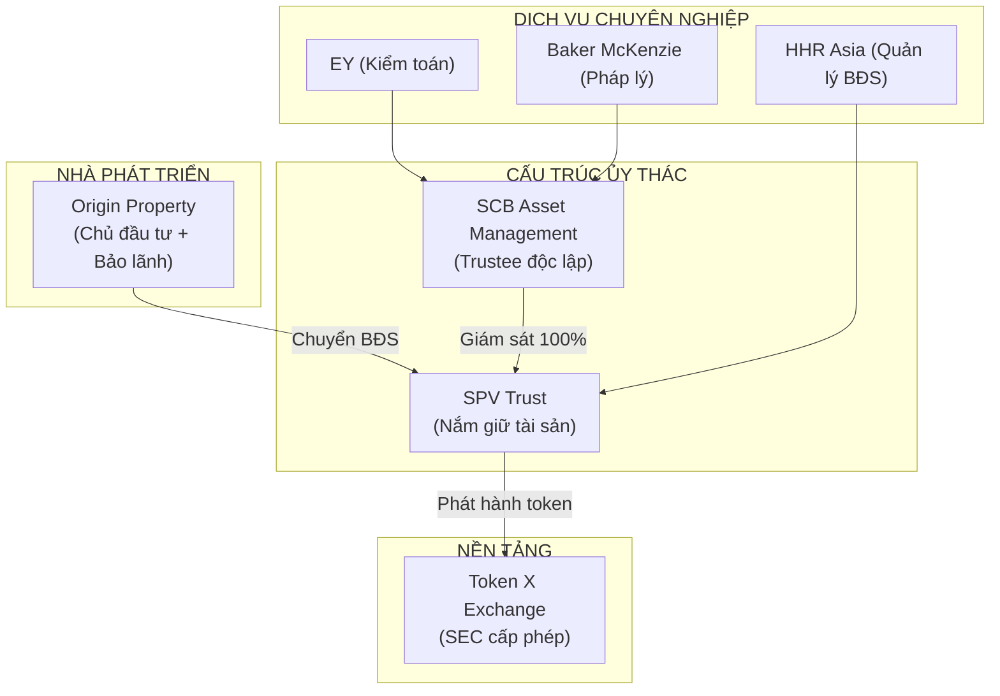

**Đặc điểm chính:**
- **Trustee độc lập**: SCB Asset Management (ngân hàng lớn Thái Lan) giám sát 100% tài sản
- **Tách biệt tài sản**: SPV Trust nắm giữ BĐS, tách biệt hoàn toàn khỏi nhà phát triển
- **SEC Thái Lan cấp phép**: Tuân thủ Digital Asset Act, ICO Portal license
- **Kiểm toán Big 4**: EY kiểm toán độc lập hàng năm
- **Pháp lý quốc tế**: Baker McKenzie đảm bảo tuân thủ

---

#### So Sánh Cơ Sở Hạ Tầng Công Nghệ

| Khía cạnh | RealX (Token hóa) | VMI (Truyền thống) |
|-----------|-------------------|-------------------|
| **Sở hữu** | Token trên blockchain | Chứng chỉ giấy (CNQTS) |
| **Chuyển nhượng** | Tự động qua smart contract | Xử lý thủ công |
| **Thanh toán** | Hợp đồng thông minh tự động | Phối hợp qua email |
| **Định giá** | Oracle cập nhật động | Báo cáo định kỳ |
| **Tuân thủ** | Sàng lọc thời gian thực | Kiểm tra thủ công |
| **Báo cáo** | Dashboard thời gian thực | Báo cáo theo yêu cầu |
| **Khả năng mở rộng** | Hàng nghìn BĐS, triệu token | Quy trình thủ công hạn chế |

---

#### Bài Học Cho RWA Việt Nam

**Yếu tố thành công cần áp dụng:**
- **Cấu trúc trustee độc lập**: Sử dụng ngân hàng lớn VN (VCB, CTG, BIDV) làm trustee
- **Tách biệt tài sản qua SPV**: Bảo vệ nhà đầu tư nếu nhà phát hành gặp vấn đề
- **Kiểm toán Big 4**: EY/PwC Vietnam để tạo uy tín
- **Tuân thủ SEC/UBCKNN**: Làm việc sớm với cơ quan quản lý
- **Công nghệ blockchain**: Smart contract cho tự động hóa và minh bạch

**Tránh sai lầm của VMI:**
- **Kiểm soát tập trung**: Không để 1 công ty kiểm soát tất cả
- **Không có giám sát độc lập**: Luôn có trustee/kiểm toán bên ngoài
- **Giá trị cố định**: Cho phép giá token dao động theo giá BĐS thực
- **Quy trình thủ công**: Tự động hóa qua smart contract

---

### So Sánh Mã Hóa BĐS vs Trái Phiếu

| Tiêu chí | Mã hóa BĐS | Mã hóa Trái phiếu |
|----------|------------|-------------------|
| **Tài sản** | Hệ sinh thái BĐS sẵn có rộng lớn<br/>Tăng thanh khoản cho sản phẩm BĐS | Uy tín thị trường của Vingroup<br/>Huy động vốn nhanh, giữ 100% quyền kiểm soát |
| **Lợi ích mã hóa** | Tiếp cận thế hệ nhà đầu tư trẻ<br/>Tạo thị trường sở hữu phân mảnh<br/>Tăng thanh khoản, giảm rủi ro | Kênh thay thế khi hạn mức tín dụng hạn chế<br/>Áp dụng lãi suất cố định + lãi thưởng<br/>Tạo thanh khoản cho nhà đầu tư |
| **Chân dung nhà đầu tư** | Nhà đầu tư trẻ tích lũy trung/dài hạn<br/>Chấp nhận biến động giá ngắn hạn | Nhà đầu tư ưu tiên phòng thủ (bảo vệ vốn)<br/>Đa dạng hóa danh mục<br/>Không muốn giao dịch thường xuyên |
| **Thanh khoản** | Tốt: Giao dịch đều đặn trên CEX | Trung bình: Nhiều NĐT giữ đến đáo hạn |
| **Giáo dục thị trường** | Phức tạp hơn nhưng hấp dẫn | Khái niệm đơn giản, quen thuộc |
| **Rủi ro phát hành** | BĐS có tỷ suất sinh lời kém<br/>→ Bắt đầu từ dự án tiềm năng cao | Thanh toán cố định bất kể kinh doanh<br/>→ Phát hành nhiều đợt nhỏ |
| **Độ phức tạp vận hành** | Cao: Cần đội ngũ lớn quản lý BĐS | Thấp: Đội ngũ nhỏ xử lý thanh toán |
| **Pháp lý** | Chưa chắc chắn nhưng khả thi | Rõ ràng: UBCKNN có quy trình |
| **Tốc độ huy động vốn** | Chậm ban đầu, tiềm năng lớn | Ổn định |
| **Tính linh hoạt** | Rất cao: 3 vai trò (Chủ BĐS, Nhà phát hành, Quản lý) | Thấp: Bị khóa cam kết lãi cố định |
| **Lợi thế người đi đầu** | Rất lớn: Chưa có nền tảng tại VN | Vừa phải: Thị trường đã tồn tại |
| **Tiếp cận vốn nước ngoài** | Lợi thế lớn: NĐT quốc tế dễ mua token hơn BĐS | Tiềm năng trung bình: NĐT tổ chức quan tâm |

---

## Phần 5: Phụ Lục

### Câu Hỏi Thường Gặp

#### Q1: Phân khúc thị trường và khả năng tiếp cận

**Câu hỏi**: Các phân khúc sản phẩm khác nhau (biệt thự vs chung cư) có điểm vào khác nhau. Trước đây, điểm vào của đầu tư biệt thự rất cao. Mã hóa có thể giúp mở rộng khả năng tiếp cận đối với các loại bất động sản không?

**Trả lời**: Có hai cách tiếp cận:
- **Cách 1 - Nhiều loại Token**: Tạo Token khác nhau cho từng loại BĐS (VD: 2 loại Token riêng cho biệt thự và chung cư)
  - Ưu điểm: Phân khúc rõ ràng, thanh khoản mục tiêu
  - Nhược điểm: Thanh khoản bị phân mảnh
- **Cách 2 - Một loại Token (Đề xuất)**: Số lượng token khác nhau cho từng loại BĐS (VD: Chung cư A1 = 1,000 token, Biệt thự A2 = 5,000 token)
  - Ưu điểm: Thanh khoản thống nhất, định giá linh hoạt
  - Nhược điểm: Cần cơ chế điều chỉnh tỷ lệ giá token giữa các loại BĐS
- **Kết luận**: Đầu tư biệt thự trước đây khó tiếp cận nhưng tỷ suất lợi nhuận thường cao hơn. Giờ đây, nhiều nhà đầu tư có thể tham gia đầu tư biệt thự thông qua sở hữu phân mảnh

---

#### Q2: Linh hoạt thanh toán

**Câu hỏi**: Đầu tư BĐS truyền thống thường yêu cầu thanh toán trước `30%`, ngân hàng giải ngân `70%` còn lại. Việc mã hóa có thể cung cấp giải pháp thanh toán tốt hơn cho nhà đầu tư không?

**Trả lời**: Có, nhà đầu tư có thể mua token từng dần theo thời gian:
- Tích lũy token cho đến khi đạt ngưỡng sở hữu toàn bộ sản phẩm BĐS
- Quyết định mua thêm token có thể dựa vào tỷ suất tăng giá của BĐS
- Đây là mô hình thanh toán linh hoạt hơn cơ chế `30%/70%` truyền thống

---

#### Q3: Ổn định giá trị Token

**Câu hỏi**: Làm thế nào để chứng minh và ổn định giá trị của mỗi token?

**Trả lời**: Cơ chế chuyển đổi token sang quyền sở hữu tài sản BĐS tạo ra sự ổn định giá:
- Người nắm giữ token có thể đổi token lấy tài sản BĐS với tỷ lệ chuyển đổi được định sẵn ban đầu
  - VD: 5,000 token tương ứng với 1 căn chung cư giá 5 tỷ VND → mỗi token được định giá ban đầu là 1 triệu VND
- Theo thời gian, nếu giá trị căn chung cư tăng lên 6 tỷ VND, giá giao dịch token trên sàn CEX sẽ xoay quanh khoảng 1.2 triệu/token vì:
  - Nếu giá thấp hơn 1.2 triệu: Sẽ có nhiều lệnh mua để gom đủ 5,000 token đổi lấy căn chung cư bán kiếm lời
  - Nếu giá cao hơn 1.2 triệu: Sẽ có nhiều lệnh bán vì quy đổi ra tài sản thực cũng không lời hơn
- **Điểm khác biệt cơ bản so với crypto thuần túy**: Tài sản thực (BĐS) tạo nền giá trị cho token

---

#### Q4: Mô hình kinh doanh sau khi sản phẩm hình thành

**Câu hỏi**: Cho những dự án mã hóa tài sản BĐS ở giai đoạn presales, khi bàn giao BĐS, có hai mô hình: (1) Bán tất cả BĐS và phân phối 100% doanh thu cho nhà đầu tư, (2) Giữ BĐS, quản lý cho thuê, và chia sẻ doanh thu thuê. So sánh hai cách tiếp cận này.

**Trả lời**:

| Tiêu chí | Mô hình 1 - Thanh lý | Mô hình 2 - Giữ & Cho thuê |
|----------|----------------------|----------------------------|
| **Mô tả** | Bán tất cả BĐS khi bàn giao<br/>Phân phối 100% thu nhập cho NĐT | Giữ BĐS, vận hành như danh mục cho thuê<br/>Phân phối thu nhập thuê hàng tháng |
| **Ưu điểm** | Thoát sạch, lợi nhuận ngay<br/>Không cần quản lý liên tục | Lợi nhuận định kỳ<br/>Tăng giá dài hạn, giữ tài sản |
| **Nhược điểm** | Thanh toán một lần<br/>Không có thu nhập định kỳ<br/>Mất tăng giá dài hạn | Cần cơ sở hạ tầng quản lý BĐS<br/>Chi phí vận hành |

- **Cách tiếp cận kết hợp**: Cho phép người nắm giữ token bỏ phiếu về chiến lược thoái vốn cho dự án BĐS sau khi bàn giao

---

#### Q5: Rủi ro danh tiếng & thương hiệu

**Câu hỏi**: Lo ngại về nhận thức tiêu cực về crypto, nếu nhà đầu tư giao dịch thua lỗ sẽ đổ lỗi cho Vingroup, làm thế nào giải quyết? Có cần thương hiệu riêng không?

**Trả lời**:
- **Cơ chế bảo vệ danh tiếng**:
  - Có cơ chế để đổi token lấy tài sản thực Vingroup (VD: BĐS, xe hơi, gói nghỉ dưỡng, voucher dịch vụ) để chứng minh giá trị thực
  - Đảm bảo lợi nhuận tối thiểu nếu người dùng không thể hoặc khó giao dịch trong vài năm đầu (VD: cho sản phẩm BĐS ở giai đoạn presales, trái phiếu)
  - Công bố rủi ro rõ ràng: Đây vẫn là sản phẩm đầu tư nếu khách hàng chấp nhận giao dịch, vì vậy thua lỗ giao dịch là trách nhiệm người dùng. Tuy nhiên, sản phẩm được thiết kế để nếu ít giao dịch, khách hàng vẫn có thể kiếm lợi nhuận
- **Chiến lược thương hiệu**:
  - Tham khảo đội marketing về thương hiệu riêng vs thương hiệu Vingroup
  - Nhấn mạnh vào việc đây là tài sản mã hóa dựa trên tài sản thực, không phải crypto đầu cơ

---

#### Q6: Chiến lược danh mục sản phẩm

**Câu hỏi**: Sản phẩm BĐS mạnh/bán chạy vs sản phẩm không bán chạy. Nên mã hóa sản phẩm nào, với lộ trình ra sao?

**Trả lời**: Chiến lược triển khai theo giai đoạn:
- **Giai đoạn 1**: Bắt đầu với dự án hàng đầu/hot để tạo tiếng vang
  - Mã hóa BĐS cao cấp với nhu cầu mua bán cao trước
  - ICO thành công, tạo tiếng vang cho mô hình
- **Giai đoạn 2**: Xây dựng niềm tin qua giao dịch
  - Cung cấp thanh khoản và tạo lập thị trường tích cực
  - Giáo dục người dùng về lợi ích của mã hóa tài sản
  - Chứng minh phân mảnh hoạt động - người dùng có thể giao dịch dễ dàng và quy đổi thuận tiện sang tài sản thực
- **Giai đoạn 3**: Chứng minh lợi nhuận
  - Cho thấy kết quả giao dịch thành công
  - Cung cấp đảm bảo hoàn vốn + lợi nhuận tối thiểu để giảm thiểu rủi ro
- **Giai đoạn 4**: Mở rộng sang danh mục rộng hơn
  - Giới thiệu sản phẩm chưa bán chạy khi đã thiết lập niềm tin
- **Tóm tắt**: Khó bán sản phẩm BĐS không bán chạy qua mã hóa ở thời điểm ban đầu do thiếu niềm tin. Xây dựng uy tín trước với sản phẩm đã được chứng minh là chiến dịch phù hợp

---

### Thuật Ngữ Thường Gặp

| Thuật ngữ | Tiếng Việt | Giải thích |
|-----------|------------|------------|
| **Token** | Chứng chỉ số | Đại diện quyền lợi kinh tế trong BĐS |
| **SPV** | Pháp nhân chuyên biệt | Special Purpose Vehicle - công ty riêng cho mục đích cụ thể |
| **Trustee** | Đơn vị ủy thác | Bên thứ ba giám sát, bảo vệ quyền lợi nhà đầu tư |
| **ICO** | Đợt phát hành đầu | Initial Coin Offering - lần đầu bán token |
| **Redemption** | Đổi token | Quy trình đổi token lấy BĐS thực |
| **Liquidation** | Thanh lý | Bán BĐS và chia tiền cho người giữ token |
| **Escrow** | Ký quỹ | Tài khoản trung gian giữ tiền an toàn |
| **Lock-up** | Khóa giao dịch | Thời gian không được bán token |
| **VIFC** | Quỹ đầu tư Vingroup | Cầu nối cho nhà đầu tư trong nước |
| **Sandbox** | Môi trường thử nghiệm | Khung pháp lý thử nghiệm có kiểm soát |
| **CEX** | Sàn giao dịch tập trung | Centralized Exchange - sàn giao dịch token |
| **RWA** | Tài sản thực | Real World Asset - tài sản có giá trị thực |
| **AO** | Chủ sở hữu tài sản gốc | Asset Originator - VD: Vinhomes |
| **Token Weight** | Số token/căn | Số lượng token đại diện cho 1 căn BĐS |
| **CNQTS** | Chứng nhận quyền tài sản | Chứng chỉ VMI xác nhận quyền sở hữu phân mảnh |
| **TĐĐT** | Thỏa thuận liên kết đầu tư | Hợp đồng giữa NĐT và VMI |
| **Oracle** | Nguồn dữ liệu | Cung cấp dữ liệu thực (giá BĐS) cho blockchain |
| **IRR** | Tỷ suất hoàn vốn nội bộ | Internal Rate of Return - chỉ số lợi nhuận |
| **SEC** | Ủy ban Chứng khoán | Securities and Exchange Commission |

---

*Tài liệu này được chuẩn bị để trình bày tổng quan về dự án token hóa bất động sản. Các thông số cụ thể (phí, tỷ lệ, thời gian) có thể thay đổi theo quyết định kinh doanh và yêu cầu pháp lý.*
