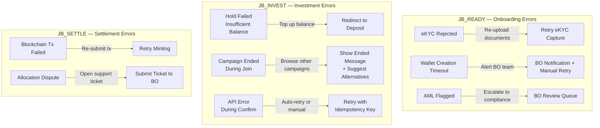
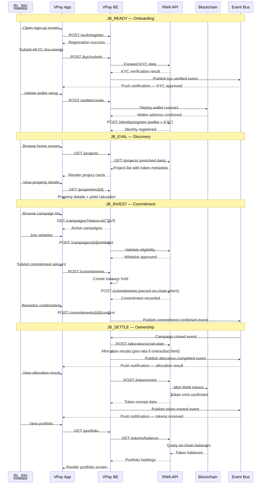

## Overview

- Codename: `JB_E2E_INV`
- Job statement: "As an investor, I want to complete the full investment lifecycle — from onboarding to portfolio management"
- Role: `RL_INV` (Investor)
- Phases: DISC → ONBO → PREO → TOKO → OSET
- This meta-flow connects 5 individual JTBDs into one end-to-end journey
- Each JTBD represents a distinct "job" the investor needs to accomplish
- The lifecycle is sequential but allows re-entry at any phase after initial onboarding

### JTBD Summary

Individual JTBD Overview

#### JTBD Table

| Codename | Job Statement | Phases | Key Epics | Doc Link |
|----------|---------------|--------|-----------|----------|
| `JB_READY` | "Get verified and ready to invest" | ONBO | EP_EKYC, EP_WLST | [jb_ready_onboarding.md](./jb_ready_onboarding.md) |
| `JB_EVAL` | "Find and evaluate investments" | PREO | EP_HOME, EP_PROJ, EP_PROP, EP_EDUC | [jb_eval_discovery.md](./jb_eval_discovery.md) |
| `JB_INVEST` | "Fund my account and invest" | PREO + TOKO | EP_DPST, EP_DISC, EP_JOIN, EP_CONF | [jb_invest_token_offering.md](./jb_invest_token_offering.md) |
| `JB_SETTLE` | "Receive and manage my tokens" | OSET | EP_OFFC, EP_ALOC, EP_PORT | [jb_settle_allocation.md](./jb_settle_allocation.md) |
| `JB_SHARE` | "Share and promote my investments" | DISC | EP_SOCV | [jb_share_social.md](./jb_share_social.md) |

---

## Happy Path Flow

### End-to-End Investor Journey

Complete lifecycle flowchart

#### Diagram

```mermaid
%%{init: {'themeCSS': '.section, .actor, .messageText, .title, text, .taskText, .cluster text { font-size: 24px !important; } .mermaid { zoom: 1.6; }','themeVariables': {'fontSize': '24px'}  } }%%
flowchart LR
    subgraph JB_READY["JB_READY — Get Verified"]
        A["VPay Entry<br/><code>investor/onbo/vpay-entry.html</code>"]
        B["KYC Gate<br/><code>investor/onbo/kyc-gate.html</code>"]
        C["Wallet Setup<br/><code>investor/onbo/wallet-setup.html</code>"]
        A --> B --> C
    end

    subgraph JB_EVAL["JB_EVAL — Find Investments"]
        F["Home<br/><code>investor/preo/home.html</code>"]
        G["Project List<br/><code>investor/preo/project-list.html</code>"]
        H["Project Details<br/><code>investor/preo/project-details.html</code>"]
        I["Property Details<br/><code>investor/preo/property-details.html</code>"]
        J["Calculator<br/><code>investor/preo/calculator.html</code>"]
        F --> G --> H --> I
        H --> J
    end

    subgraph JB_INVEST["JB_INVEST — Fund and Invest"]
        K["Campaign List<br/><code>investor/toko/campaign-list.html</code>"]
        L["Whitelist Join<br/><code>investor/toko/whitelist-join.html</code>"]
        M["Commitment<br/><code>investor/toko/commitment.html</code>"]
        N["Confirmation<br/><code>investor/toko/confirmation.html</code>"]
        O["Status Tracking<br/><code>investor/toko/status-tracking.html</code>"]
        K --> L --> M --> N --> O
    end

    subgraph JB_SETTLE["JB_SETTLE — Receive Tokens"]
        P["Allocation Result<br/><code>investor/oset/allocation-result.html</code>"]
        Q["Payment<br/><code>investor/oset/payment.html</code>"]
        R["Token Receipt<br/><code>investor/oset/token-receipt.html</code>"]
        S["Portfolio<br/><code>investor/oset/portfolio.html</code>"]
        P --> Q --> R --> S
    end

    subgraph JB_SHARE["JB_SHARE — Share Portfolio"]
        T["Share Portfolio"]
        U["Peer Views"]
        V["Referral"]
        T --> U --> V
    end

    C -->|"Onboarding complete"| F
    I -->|"Ready to invest"| K
    O -->|"Campaign closed"| P
    S -->|"Portfolio active"| T
```

#### Screen Mapping Table

| Node ID | Screen Label | Wireframe Path | PRD Source | JTBD |
|---------|-------------|----------------|------------|------|
| A | VPay Entry | `investor/onbo/vpay-entry.html` | [EP_EKYC](../../../nghia_po_proposal/prd/rp2511_e47_sseq_onbo_ep_ekyc.md) | `JB_READY` |
| B | KYC Gate | `investor/onbo/kyc-gate.html` | [EP_EKYC](../../../nghia_po_proposal/prd/rp2511_e47_sseq_onbo_ep_ekyc.md) | `JB_READY` |
| C | Wallet Setup | `investor/onbo/wallet-setup.html` | [EP_WLST](../../../nghia_po_proposal/prd/rp2511_e47_sseq_onbo_ep_wlst.md) | `JB_READY` |
| F | Home | `investor/preo/home.html` | [EP_HOME](../../../nghia_po_proposal/prd/rp2511_e48_sseq_preo_ep_home.md) | `JB_EVAL` |
| G | Project List | `investor/preo/project-list.html` | [EP_PROJ](../../../nghia_po_proposal/prd/rp2511_e48_sseq_preo_ep_proj.md) | `JB_EVAL` |
| H | Project Details | `investor/preo/project-details.html` | [EP_PROJ](../../../nghia_po_proposal/prd/rp2511_e48_sseq_preo_ep_proj.md) | `JB_EVAL` |
| I | Property Details | `investor/preo/property-details.html` | [EP_PROP](../../../nghia_po_proposal/prd/rp2511_e48_sseq_preo_ep_prop.md) | `JB_EVAL` |
| J | Calculator | `investor/preo/calculator.html` | [EP_EDUC](../../../nghia_po_proposal/prd/rp2511_e48_sseq_preo_ep_educ.md) | `JB_EVAL` |
| K | Campaign List | `investor/toko/campaign-list.html` | [EP_DISC](../../../nghia_po_proposal/prd/rp2511_e49_sseq_toko_ep_disc.md) | `JB_INVEST` |
| L | Whitelist Join | `investor/toko/whitelist-join.html` | [EP_JOIN](../../../nghia_po_proposal/prd/rp2511_e49_sseq_toko_ep_join.md) | `JB_INVEST` |
| M | Commitment | `investor/toko/commitment.html` | [EP_CONF](../../../nghia_po_proposal/prd/rp2511_e49_sseq_toko_ep_conf.md) | `JB_INVEST` |
| N | Confirmation | `investor/toko/confirmation.html` | [EP_CONF](../../../nghia_po_proposal/prd/rp2511_e49_sseq_toko_ep_conf.md) | `JB_INVEST` |
| O | Status Tracking | `investor/toko/status-tracking.html` | [EP_CONF](../../../nghia_po_proposal/prd/rp2511_e49_sseq_toko_ep_conf.md) | `JB_INVEST` |
| P | Allocation Result | `investor/oset/allocation-result.html` | [EP_ALOC](../../../nghia_po_proposal/prd/rp2511_e50_sseq_oset_ep_aloc.md) | `JB_SETTLE` |
| Q | Payment | `investor/oset/payment.html` | [EP_OFFC](../../../nghia_po_proposal/prd/rp2511_e50_sseq_oset_ep_offc.md) | `JB_SETTLE` |
| R | Token Receipt | `investor/oset/token-receipt.html` | [EP_ALOC](../../../nghia_po_proposal/prd/rp2511_e50_sseq_oset_ep_aloc.md) | `JB_SETTLE` |
| S | Portfolio | `investor/oset/portfolio.html` | [EP_PORT](../../../nghia_po_proposal/prd/rp2511_e50_sseq_oset_ep_port.md) | `JB_SETTLE` |

---

## Decision Points

### Key Branching Logic

Decision points across the lifecycle

#### Decision Table

| Decision Point | Condition | True Path | False Path | JTBD |
|---------------|-----------|-----------|------------|------|
| KYC verified? | `kycLevel` `>=` 2 | Proceed to wallet setup | Show KYC gate — redirect to eKYC capture | `JB_READY` |
| Wallet type? | POC phase | Auto-create platform wallet | User chooses wallet provider | `JB_READY` |
| AML clean? | risk score `<` 30 | Register identity on-chain | BO review queue or block | `JB_READY` |
| Sufficient balance? | balance `>=` commitment amount | Create hold on balance | Redirect to deposit flow | `JB_INVEST` |
| Campaign active? | status = `ACTIVE` | Allow whitelist join | Show campaign ended message | `JB_INVEST` |
| Whitelist approved? | whitelist status = `APPROVED` | Proceed to commitment | Show pending or rejected state | `JB_INVEST` |
| Biometric success? | auth passed | Confirm commitment | PIN fallback or retry biometric | `JB_INVEST` |
| Oversubscribed? | demand `>` supply | Pro-rata allocation applied | Full allocation granted | `JB_SETTLE` |
| Token minted? | blockchain tx confirmed | Show token receipt | Show pending with retry | `JB_SETTLE` |

---

## Error Paths

### Error Recovery Flows

Error handling across the lifecycle

#### Error Diagram

#### Recovery Table

| Error | Trigger | Recovery Action | JTBD |
|-------|---------|-----------------|------|
| eKYC rejected | Document quality check failed or identity mismatch | Re-upload documents via eKYC capture screen; max 3 retries before BO escalation | `JB_READY` |
| Wallet creation timeout | Blockchain node unresponsive or network congestion | BO receives notification; manual wallet provisioning fallback | `JB_READY` |
| AML flagged | Risk score `>=` 30 from screening provider | Case routed to BO AML investigation queue; investor sees pending state | `JB_READY` |
| Insufficient balance | `balance` `<` `commitment amount` at hold creation | Redirect investor to deposit screen with pre-filled shortfall amount | `JB_INVEST` |
| Campaign ended during join | Campaign status changed to `ENDED` between page load and submission | Show campaign ended message; suggest alternative active campaigns | `JB_INVEST` |
| API error during confirm | HTTP 5xx or network timeout on commitment confirmation | Retry with idempotency key; show error toast with manual retry button | `JB_INVEST` |
| Biometric auth failed | Face ID or fingerprint mismatch | Fall back to PIN entry; lock after 5 failed PIN attempts | `JB_INVEST` |
| Blockchain tx failed | Gas estimation failure or smart contract revert | Auto-retry minting up to 3 times; escalate to admin if all retries fail | `JB_SETTLE` |
| Allocation dispute | Investor questions pro-rata result | Submit support ticket via `investor/supp/submit-ticket.html`; BO reviews | `JB_SETTLE` |

---

## Cross-Role Interactions

### System Sequence Overview

VPay ↔ RWA Platform ↔ Blockchain interactions

#### Sequence Diagram

---

## References

### Source Documents

PRD and wireframe references

#### PRD Links

- [EP_SOCV — Social Validation (DISC)](../../../nghia_po_proposal/prd/rp2511_e46_sseq_disc_ep_socv.md)
- [EP_EKYC — eKYC Verification (ONBO)](../../../nghia_po_proposal/prd/rp2511_e47_sseq_onbo_ep_ekyc.md)
- [EP_WLST — Wallet Setup (ONBO)](../../../nghia_po_proposal/prd/rp2511_e47_sseq_onbo_ep_wlst.md)
- [EP_HOME — Home Screen (PREO)](../../../nghia_po_proposal/prd/rp2511_e48_sseq_preo_ep_home.md)
- [EP_PROJ — Project Discovery (PREO)](../../../nghia_po_proposal/prd/rp2511_e48_sseq_preo_ep_proj.md)
- [EP_PROP — Property Details (PREO)](../../../nghia_po_proposal/prd/rp2511_e48_sseq_preo_ep_prop.md)
- [EP_EDUC — Education / Calculator (PREO)](../../../nghia_po_proposal/prd/rp2511_e48_sseq_preo_ep_educ.md)
- [EP_DPST — Deposit (PREO)](../../../nghia_po_proposal/prd/rp2511_e48_sseq_preo_ep_dpst.md)
- [EP_DISC — Campaign Discovery (TOKO)](../../../nghia_po_proposal/prd/rp2511_e49_sseq_toko_ep_disc.md)
- [EP_JOIN — Whitelist Join (TOKO)](../../../nghia_po_proposal/prd/rp2511_e49_sseq_toko_ep_join.md)
- [EP_CONF — Commitment Confirmation (TOKO)](../../../nghia_po_proposal/prd/rp2511_e49_sseq_toko_ep_conf.md)
- [EP_OFFC — Off-chain Settlement (OSET)](../../../nghia_po_proposal/prd/rp2511_e50_sseq_oset_ep_offc.md)
- [EP_ALOC — Token Allocation (OSET)](../../../nghia_po_proposal/prd/rp2511_e50_sseq_oset_ep_aloc.md)
- [EP_PORT — Portfolio Management (OSET)](../../../nghia_po_proposal/prd/rp2511_e50_sseq_oset_ep_port.md)

#### Wireframe Links

- Onboarding (ONBO):
  - ../../investor/onbo/vpay-entry.html
  - ../../investor/onbo/kyc-gate.html
  - ../../investor/onbo/wallet-setup.html
- Pre-Offering (PREO):
  - ../../investor/preo/home.html
  - ../../investor/preo/project-list.html
  - ../../investor/preo/project-details.html
  - ../../investor/preo/property-details.html
  - ../../investor/preo/calculator.html
- Token Offering (TOKO):
  - ../../investor/toko/campaign-list.html
  - ../../investor/toko/whitelist-join.html
  - ../../investor/toko/commitment.html
  - ../../investor/toko/confirmation.html
  - ../../investor/toko/status-tracking.html
- Ownership Settlement (OSET):
  - ../../investor/oset/allocation-result.html
  - ../../investor/oset/payment.html
  - ../../investor/oset/token-receipt.html
  - ../../investor/oset/portfolio.html

