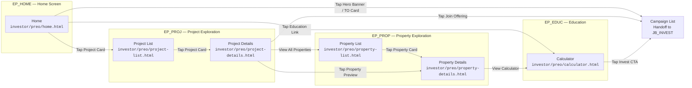
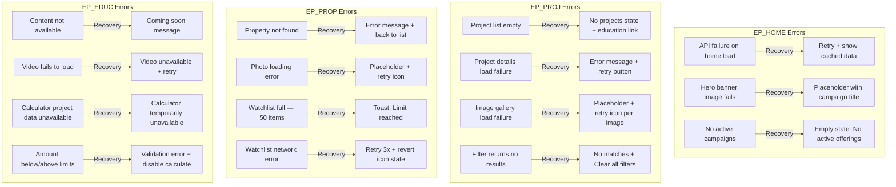
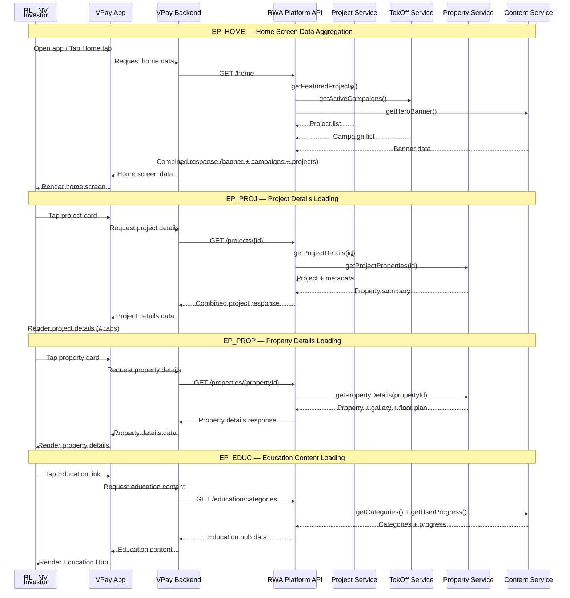

## Overview

Job-to-be-Done: Find and Evaluate Investments

- **Codename:** `JB_EVAL`
- **Job statement:** "As an investor, I want to find and evaluate investments so that I can make informed decisions"
- **Role:** `RL_INV`
- **Phases:** PREO
- **Epics:** `EP_HOME`, `EP_PROJ`, `EP_PROP`, `EP_EDUC`
- **Wireframe screens:** 6 screens in `investor/preo/`
- **Entry point:** Home screen after onboarding (`JB_READY`)
- **Exit point:** Token Offering (handoff to `JB_INVEST`)

#### Epic Summary

| Epic | Features | Description |
|------|----------|-------------|
| `EP_HOME` — Home Screen Display | FT_HERO (Hero Banner) FT_TOCO (Token Offering Cards) FT_FEAT (Featured Projects + Education + Market Highlights) | Primary entry point after login. Displays hero banner, active/upcoming TO cards, featured projects, education link, and market highlights. Hands off to `EP_PROJ`, `UF_TOKO`, or `EP_EDUC`. |
| `EP_PROJ` — Project Exploration | FT_PJLS (Project List) FT_PJCM (Project Comparison) FT_PJDT (Project Details) FT_IMGL (Image Gallery) | Browse, filter, compare, and research real estate projects. Grid/list view, side-by-side comparison (up to 3), tabbed details (Overview, Properties, Documents, Market Data), and 10+ photo gallery with 360 tour. |
| `EP_PROP` — Property Exploration | FT_PPLS (Property List) FT_PPDT (Property Details) FT_WTLS (Watchlist) | Browse and filter individual properties within a project via dedicated Property List screen (`property-list.html`) with search, type filters, sort, and pagination. View 5-image gallery with counter, floor plan, specifications, location map. FT_PJCM (comparison), FT_IMGL (full gallery), FT_WTLS (watchlist) deferred for Alpha. |
| `EP_EDUC` — Educational Content | FT_EDCT (Education Center) FT_CALC (Investment Calculator) | Education Hub with categorized articles (Getting Started, Advanced Topics, FAQs) and Investment Calculator for ROI estimation with bank savings comparison. Hands off to `UF_TOKO` via "Invest Now" CTA. |

---

## Happy Path Flow

### Discovery & Evaluation Journey

End-to-end browsing flow from Home to Token Offering handoff

#### Diagram

---

#### Screen Mapping Table

| Screen | Wireframe | Epic | Key Features | Entry From | Exit To |
|--------|-----------|------|--------------|------------|---------|
| Home | `investor/preo/home.html` | `EP_HOME` | Hero banner (FT_HERO) TO cards (FT_TOCO) Featured projects (FT_FEAT) Explore mode (`?mode=explore`): KYC banner, restricted Buy Tokens | `JB_READY` (onboarding complete) or KYC skip (`?mode=explore`) | `EP_PROJ`, `EP_EDUC`, `UF_TOKO` |
| Project List | `investor/preo/project-list.html` | `EP_PROJ` | Grid/list view (FT_PJLS) Filter by location, type, status Sort by valuation, price, date | Home (project card tap) | Project Details |
| Project Details | `investor/preo/project-details.html` | `EP_PROJ` | Project overview (FT_PJDT) 3-property preview with count badge "View All N Properties" link Join Offering CTA | Project List (card tap) | Property List, Property Details, `UF_TOKO`, `EP_EDUC` |
| Property List | `investor/preo/property-list.html` | `EP_PROP` | Dedicated property browsing (FT_PPLS) Search by address Filter chips: All, Apartment, Villa, Shophouse, Penthouse Sort: NAV, Area, Floor "Load More" pagination (10 at a time) | Project Details ("View All" link) | Property Details |
| Property Details | `investor/preo/property-details.html` | `EP_PROP` | 5-image gallery with counter badge and dot indicators (FT_PPDT) Specs, location map NAV card with token equivalent | Property List (card tap) or Project Details (preview tap) | `EP_EDUC` (calculator) |
| Calculator | `investor/preo/calculator.html` | `EP_EDUC` | Investment amount input (FT_CALC) Token count, ROI, yield `%` Invest Now CTA Back via `history.back()` | Home (education link), Property Details, Project Details | `UF_TOKO` (Invest CTA) |

---

## Decision Points

### Key Branching Logic

User decision points across all four epics

#### Decision Table

| Screen | Decision Point | Options | Target |
|--------|---------------|---------|--------|
| Home (`EP_HOME`) | User action on home screen | Tap Hero Banner | Campaign Details (`UF_TOKO`) |
| | | Tap TO Card | Campaign Details (`UF_TOKO`) |
| | | Tap Project Card | Project Details (`EP_PROJ`) |
| | | Tap Education Link | Education Hub (`EP_EDUC`) |
| | | No action / browse | Stay on Home Screen |
| Project List (`EP_PROJ`) | User action on project list | Tap Project Card | Project Details (FT_PJDT) |
| | | Select for Comparison | Project Comparison (FT_PJCM) |
| | | Apply Filters | Filtered List (FT_PJLS) |
| Project Details (`EP_PROJ`) | Detail action | View All Properties | Property List (`EP_PROP` — FT_PPLS) |
| | | Tap Property Preview | Property Details (FT_PPDT) |
| | | Tap Join Offering | Token Offering (`UF_TOKO`) |
| | | Investment Calculator | Calculator (FT_CALC) |
| Property List (`EP_PROP`) | Browsing action | Search by Address | Filtered Property List |
| | | Filter by Type | Type-filtered Property List |
| | | Sort by NAV/Area/Floor | Sorted Property List |
| | | Tap Property Card | Property Details (FT_PPDT) |
| | | Load More | Show next 10 properties |
| Property Details (`EP_PROP`) | Detail action | Scroll Image Gallery | 5-image carousel with counter |
| | | View Calculator | Financial Calculator |
| | | View Map | Location Map with Amenities |
| Education (`EP_EDUC`) | User action | Browse Articles | Article View (FT_EDCT) |
| | | Use Calculator | Investment Calculator (FT_CALC) |
| | | Browse FAQs | FAQ Section (FT_EDCT) |
| Calculator (`EP_EDUC`) | Result action | Tap Invest CTA | Token Offering (`UF_TOKO`) — amount pre-filled, handoff to `JB_INVEST` |
| | | Modify Inputs | Recalculate |
| | | Back | Return to Education Hub |

---

## Error Paths

### Error Recovery Flows

Error scenarios and recovery strategies

#### Error Diagram

---

#### Recovery Table

| Screen | Error Scenario | User Experience | Recovery Action |
|--------|---------------|-----------------|-----------------|
| Home | API aggregation failure | Cached home screen displayed with "Last updated" timestamp | Auto-retry on reconnect; pull-to-refresh available |
| Home | Partial data failure (TokOff Service down) | Projects section loads normally; TO cards show "Unable to load offerings. Tap to retry." | Each section loads independently; tap-to-retry per section |
| Home | Offline mode | Cached data shown; "Offline" indicator; CTA buttons disabled | Auto-refresh on reconnection |
| Project List | No projects exist | "No projects available yet" + education link | Admin publishes project via `EP_PROJ` admin flow |
| Project List | Filter returns empty | "No matches found" + "Try adjusting your filters" + "Clear all filters" button | Tap clear to reset filters |
| Project Details | Project not found (404) | "Project not found" + "Back to Projects" button | Navigate back to project list |
| Project Details | Documents not uploaded | Per-document placeholder: "Document will be available soon" | Admin uploads via `EP_INIT` |
| Image Gallery | Image fails to load | Placeholder with retry icon; can swipe past to next image | Tap retry to reload; swipe to skip |
| Property Details | Property not found (404) | "Property not found" + "Back to Properties" button | Navigate back to property list |
| Property Details | Watchlist full (50 items) | Toast: "Watchlist limit reached (50 items). Remove a property before adding new ones." | Heart icon stays outlined; remove items first |
| Property Details | Watchlist network error | Heart icon reverts to previous state; toast: "Unable to save. Check your connection." | Retry with exponential backoff (3 attempts) |
| Education Hub | No published content | "Educational content coming soon" + home link; calculator still accessible | Admin publishes content via CMS |
| Education Hub | Article not found (404) | "Article not found" + link back to Education Hub | Navigate back to hub |
| Calculator | Project data unavailable | "Calculator temporarily unavailable. Please try again later." + disabled inputs | Retry button; education articles remain accessible |
| Calculator | Amount below minimum | Validation: "Minimum investment is `10,000,000` VND"; calculate button disabled | User adjusts amount to valid range |
| Calculator | Amount above maximum | Validation: "Maximum investment is `100,000,000` VND"; calculate button disabled | User adjusts amount to valid range |

---

## Cross-Role Interactions

### System Sequence

System interactions for home data aggregation and project/property data loading

#### Sequence Diagram

---

## References

### Source Documents

PRD and wireframe links

#### PRD Links

- [EP_HOME PRD](../../../nghia_po_proposal/prd/rp2511_e48_sseq_preo_ep_home.md) — Home Screen Display for Investor (UF_PREO.EP_HOME)
  - Features: FT_HERO, FT_TOCO, FT_FEAT
  - 3 API endpoints: `GET /home`, `GET /campaigns/active`, `GET /projects/featured`
- [EP_PROJ PRD](../../../nghia_po_proposal/prd/rp2511_e48_sseq_preo_ep_proj.md) — Project Exploration for Investor (UF_PREO.EP_PROJ)
  - Features: FT_PJLS, FT_PJCM, FT_PJDT, FT_IMGL
  - 4 API endpoints: `GET /projects`, `GET /projects/{id}`, `GET /projects/compare`, `GET /projects/{id}/gallery`
- [EP_PROP PRD](../../../nghia_po_proposal/prd/rp2511_e48_sseq_preo_ep_prop.md) — Property Exploration for Investor (UF_PREO.EP_PROP)
  - Features: FT_PPLS, FT_PPDT, FT_WTLS
  - 4 API endpoints: `GET /projects/{projectId}/properties`, `GET /properties/{propertyId}`, `POST /watchlist/add`, `DELETE /watchlist/{propertyId}`
- [EP_EDUC PRD](../../../nghia_po_proposal/prd/rp2511_e48_sseq_preo_ep_educ.md) — Educational Content for Investor (UF_PREO.EP_EDUC)
  - Features: FT_EDCT, FT_CALC
  - 2 API endpoints: `GET /education/categories`, `GET /education/articles/{articleId}`

---

#### Wireframe Links

- ../../investor/preo/home.html — `investor/preo/home.html`
- ../../investor/preo/project-list.html — `investor/preo/project-list.html`
- ../../investor/preo/project-details.html — `investor/preo/project-details.html`
- ../../investor/preo/property-list.html — `investor/preo/property-list.html`
- ../../investor/preo/property-details.html — `investor/preo/property-details.html`
- ../../investor/preo/calculator.html — `investor/preo/calculator.html`

