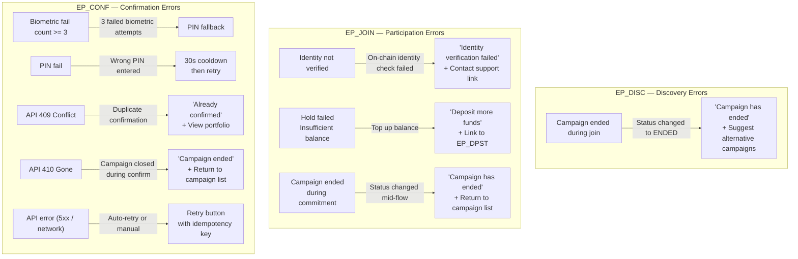
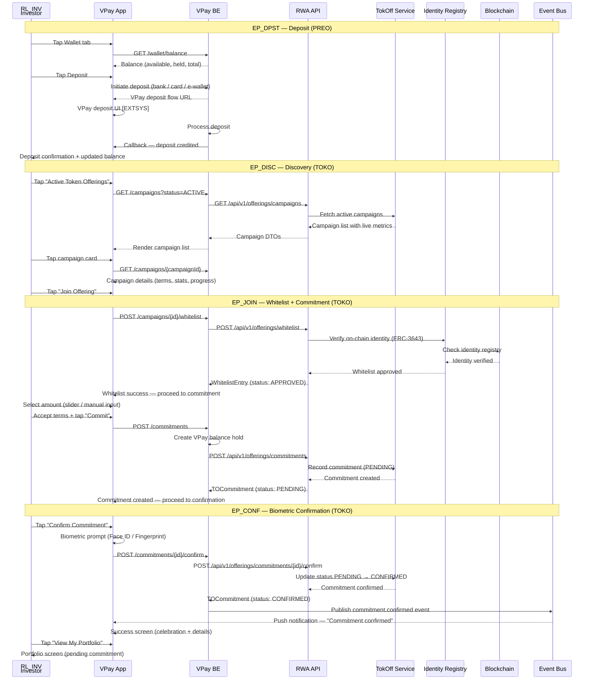

## Overview

- Codename: `JB_INVEST`
- Job statement: "As an investor, I want to fund my account and invest in token offerings so that I can own real estate tokens"
- Role: `RL_INV`
- Phases: PREO + TOKO
- Epics: `EP_DPST` (Deposit), `EP_DISC` (Discovery/Campaign List), `EP_JOIN` (Whitelist + Commitment), `EP_CONF` (Biometric Confirmation)
- Wireframe screens: 6 screens in `investor/toko/`
- Entry point: From `JB_EVAL` (project/campaign discovery)
- Exit point: Portfolio with pending commitment (handoff to `JB_SETTLE`)

### Epic Summary

Epics and features in JB_INVEST

#### Epic Table

| Epic (Phase) | Features | Description |
|---|---|---|
| `EP_DPST` (PREO) | `FT_WALL` — Wallet Screen `FT_METH` — Deposit Methods [EXTSYS] `FT_CONF` — Deposit Confirmation | View VPay balance (available, held, total), initiate deposit via bank transfer / card / e-wallet, receive deposit confirmation callback |
| `EP_DISC` (TOKO) | `FT_CPLS` — Campaign List `FT_CPDT` — Campaign Details | Browse active Token Offering campaigns with Kickstarter-style live metrics (amount raised, investor count, `%` funded, countdown), view campaign details, tap "Join Offering" CTA |
| `EP_JOIN` (TOKO) | `FT_WTLT` — Whitelist Verification `FT_CMMT` — Commitment Creation | On-chain identity check via Identity Registry, amount selection (slider + manual input), VPay balance hold creation, terms acceptance |
| `EP_CONF` (TOKO) | `FT_BIOM` — Biometric Authentication `FT_SUCC` — Success Screen | Face ID / fingerprint confirmation (PIN fallback), celebration animation, commitment details, "View My Portfolio" CTA |

---

## Happy Path Flow

### Investment Journey

End-to-end investment flowchart with wireframe screen mapping

#### Diagram

```mermaid
%%{init: {'themeCSS': '.section, .actor, .messageText, .title, text, .taskText, .cluster text { font-size: 24px !important; } .mermaid { zoom: 1.6; }','themeVariables': {'fontSize': '24px'}  } }%%
flowchart LR
    subgraph EP_DPST["EP_DPST — Deposit (PREO)"]
        D1["Home Screen"]
        D2["Wallet Tab<br/>FT_WALL: Balance Display"]
        D3["Deposit Methods<br/>FT_METH [EXTSYS]"]
        D4["VPay Deposit Flow"]
        D5["Deposit Confirmation<br/>FT_CONF"]
        D1 --> D2 -->|"Tap Deposit"| D3 --> D4 --> D5
    end

    subgraph EP_DISC["EP_DISC — Discovery (TOKO)"]
        A["Campaign List<br/><code>investor/toko/campaign-list.html</code>"]
        A2["Campaign Details<br/>FT_CPDT<br/><code>investor/toko/campaign-details.html</code>"]
        A -->|"Tap Campaign Card"| A2
    end

    subgraph EP_JOIN["EP_JOIN — Whitelist + Commitment (TOKO)"]
        B["Whitelist Join<br/><code>investor/toko/whitelist-join.html</code>"]
        C["Commitment<br/><code>investor/toko/commitment.html</code>"]
        B -->|"Identity verified"| C
    end

    subgraph EP_CONF["EP_CONF — Confirmation (TOKO)"]
        D["Confirmation<br/><code>investor/toko/confirmation.html</code>"]
        E["Status Tracking<br/><code>investor/toko/status-tracking.html</code>"]
        D -->|"Biometric success"| E
    end

    D5 -->|"Funds ready"| A
    A2 -->|"Tap 'Join Offering'"| B
    C -->|"Commitment created (PENDING)"| D
    E -->|"Handoff → JB_SETTLE"| F["Portfolio<br/>(Pending Commitment)"]
```

#### Screen Mapping Table

| Node ID | Screen Label | Wireframe Path | PRD Source | Epic |
|---------|-------------|----------------|------------|------|
| A | Campaign List | `investor/toko/campaign-list.html` | [EP_DISC](../../../nghia_po_proposal/prd/rp2511_e49_sseq_toko_ep_disc.md) | `EP_DISC` |
| A2 | Campaign Details | `investor/toko/campaign-details.html` | [EP_DISC](../../../nghia_po_proposal/prd/rp2511_e49_sseq_toko_ep_disc.md) | `EP_DISC` |
| B | Whitelist Join | `investor/toko/whitelist-join.html` | [EP_JOIN](../../../nghia_po_proposal/prd/rp2511_e49_sseq_toko_ep_join.md) | `EP_JOIN` |
| C | Commitment | `investor/toko/commitment.html` | [EP_JOIN](../../../nghia_po_proposal/prd/rp2511_e49_sseq_toko_ep_join.md) | `EP_JOIN` |
| D | Confirmation | `investor/toko/confirmation.html` | [EP_CONF](../../../nghia_po_proposal/prd/rp2511_e49_sseq_toko_ep_conf.md) | `EP_CONF` |
| E | Status Tracking | `investor/toko/status-tracking.html` | [EP_CONF](../../../nghia_po_proposal/prd/rp2511_e49_sseq_toko_ep_conf.md) | `EP_CONF` |

---

## Decision Points

### Key Branching Logic

Decision points across the investment flow

#### Decision Table

| Decision Point | Condition | True Path | False Path | Epic |
|---------------|-----------|-----------|------------|------|
| Sufficient balance? | `balance` `>=` `commitmentAmount` | Proceed to campaign discovery | Redirect to deposit flow (`EP_DPST`) with pre-filled shortfall amount | `EP_DPST` |
| Campaign active? | `campaign.status` = `ACTIVE` | Allow browsing and joining | Show "Campaign has ended" message with alternative campaigns | `EP_DISC` |
| KYC Level 2? | `kycLevel` `>=` 2 | Proceed to whitelist verification | Show KYC gate — redirect to eKYC flow | `EP_JOIN` |
| Already whitelisted? | `whitelistEntry.status` = `APPROVED` | Skip whitelist step, proceed directly to commitment | Run on-chain identity verification | `EP_JOIN` |
| Amount valid? | `minCommitment` `<=` `amount` `<=` `maxCommitment` | Enable "Commit" button | Show validation error (amount too low or too high) | `EP_JOIN` |
| Terms checkbox checked? | `termsAccepted` = `true` | Enable "Commit" button | Keep "Commit" button disabled | `EP_JOIN` |
| Hold created? | VPay hold API returns success | Proceed to biometric confirmation | Show "Insufficient balance" — link to `EP_DPST` | `EP_JOIN` |
| Biometric available on device? | Device supports Face ID / fingerprint | Show biometric prompt | Fall back to PIN entry | `EP_CONF` |
| Biometric success? | Auth passed within 3 attempts | Confirm commitment (status PENDING to CONFIRMED) | Fall back to PIN entry after 3 failed biometric attempts | `EP_CONF` |
| API response? | `200 OK` | Show success screen with celebration animation | Handle error: `409` (already confirmed), `410` (campaign ended), `5xx` (retry button) | `EP_CONF` |

---

## Error Paths

### Error Recovery Flows

Error handling and recovery across the investment flow

#### Error Diagram

#### Recovery Table

| Error | Trigger | Recovery Action | Epic |
|-------|---------|-----------------|------|
| Campaign ended during join | Campaign status changed to `ENDED` between page load and action | Show "Campaign has ended" message; suggest alternative active campaigns from `EP_DISC` | `EP_DISC` |
| Identity not verified | On-chain identity check failed via Identity Registry | Show "Identity verification failed" with contact support link; BO escalation if persistent | `EP_JOIN` |
| Hold failed — insufficient balance | `balance` `<` `commitmentAmount` at VPay hold creation | Redirect to deposit screen (`EP_DPST`) with pre-filled shortfall amount | `EP_JOIN` |
| Campaign ended during commitment | Campaign status changed to `ENDED` while investor fills commitment form | Show "Campaign has ended" message; return to campaign list | `EP_JOIN` |
| Biometric auth failed (3x) | Face ID or fingerprint mismatch 3 consecutive times | Fall back to PIN entry; show "Use PIN instead" prompt | `EP_CONF` |
| PIN auth failed | Wrong PIN entered | 30-second cooldown period; lock after 5 consecutive PIN failures with BO escalation | `EP_CONF` |
| API 409 Conflict | Duplicate `POST /commitments/{id}/confirm` (already confirmed) | Show "Already confirmed" message with "View My Portfolio" CTA | `EP_CONF` |
| API 410 Gone | Campaign closed between confirmation page load and biometric submission | Show "Campaign ended" message; return to campaign list; VPay hold auto-released | `EP_CONF` |
| API error (5xx / network) | HTTP 5xx or network timeout on commitment confirmation | Retry with idempotency key; show error toast with manual retry button | `EP_CONF` |

---

## Cross-Role Interactions

### System Sequence

RL_INV to Blockchain system interaction sequence

#### Sequence Diagram

---

## References

### Source Documents

PRD and wireframe references

#### PRD Links

- [EP_DPST — VPay Wallet Funding (PREO)](../../../nghia_po_proposal/prd/rp2511_e48_sseq_preo_ep_dpst.md)
- [EP_DISC — Token Offering Discovery (TOKO)](../../../nghia_po_proposal/prd/rp2511_e49_sseq_toko_ep_disc.md)
- [EP_JOIN — Token Offering Participation (TOKO)](../../../nghia_po_proposal/prd/rp2511_e49_sseq_toko_ep_join.md)
- [EP_CONF — Commitment Confirmation (TOKO)](../../../nghia_po_proposal/prd/rp2511_e49_sseq_toko_ep_conf.md)

#### Wireframe Links

- Token Offering (TOKO):
  - ../../investor/toko/campaign-list.html
  - ../../investor/toko/campaign-details.html
  - ../../investor/toko/whitelist-join.html
  - ../../investor/toko/commitment.html
  - ../../investor/toko/confirmation.html
  - ../../investor/toko/status-tracking.html

