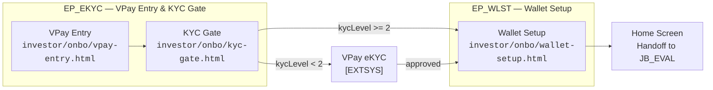
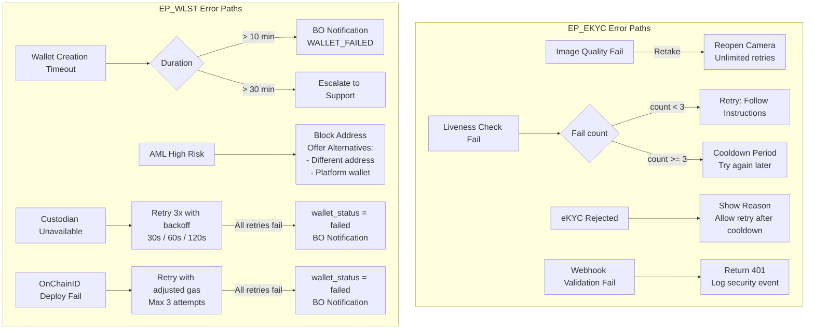
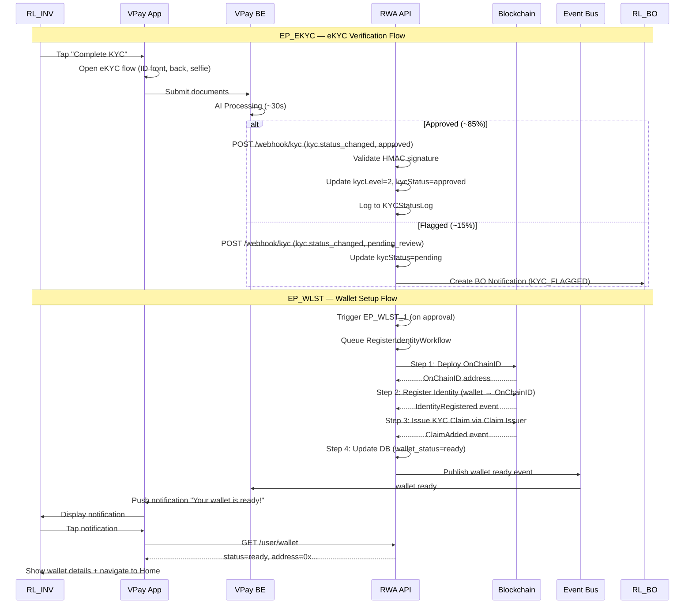

## Overview

- **Codename:** `JB_READY`
- **Job Statement:** "As an investor, I want to get verified and ready to invest so that I can participate in token offerings"
- **Role:** `RL_INV`
- **Phases:** ONBO
- **Epics:** `EP_EKYC` (eKYC Verification), `EP_WLST` (Wallet Setup)
- **Wireframe Screens:** 3 screens in `investor/onbo/`
  - `investor/onbo/vpay-entry.html`
  - `investor/onbo/kyc-gate.html`
  - `investor/onbo/wallet-setup.html`

### Epic Summary

Epic and feature breakdown for JB_READY

| Epic / Feature | Description |
|-------|-------------|
| **`EP_EKYC`** — eKYC Verification | KYC Level 2 verification required for all investment actions. - `FT_VPAY`: VPay entry point — seamless transition from VPay app into POLARIS - `FT_GATE`: KYC gate screen displayed when `kycLevel` `<` 2, redirects to VPay eKYC - `FT_DOCS` `[EXTSYS]`: 3-step document upload (National ID front, back, selfie with liveness) — handled by VPay eKYC system - `FT_APRC` `[EXTSYS]`: AI processing (~30s) with ~85% auto-approval, ~15% flagged for BO review — handled by VPay |
| **`EP_WLST`** — Wallet Setup | Blockchain identity setup after KYC approval. - `FT_PRMT`: Wallet type selection (POC: auto-create, Alpha+: user chooses) - `FT_AUTO` / `EP_WLST_1`: Platform wallet creation via BitGo/Fireblocks + RegisterIdentityWorkflow - `FT_SELF` / `EP_WLST_2`: Self-custody wallet linking with AML screening (Alpha+ only) - `FT_IDRG`: Shared 4-step Temporal workflow (deploy OnChainID, register identity, issue KYC claim, update DB) - `FT_NTFY`: Event bus notifications (`wallet.ready`, `wallet.linked`, `wallet.aml_flagged`) |

---

## Happy Path Flow

### Onboarding Journey

End-to-end happy path from sign-up to home screen

#### Diagram

- **VPay Entry** — first-time POLARIS entry from VPay app, shows VPay account info, seamless transition
- **KYC Gate** — checks KYC Level 2 status; if not met, directs user to VPay eKYC (`[EXTSYS]`, outside POLARIS scope)
- **Wallet Setup** — platform wallet auto-created via Fireblocks, followed by 4-step RegisterIdentityWorkflow (Create Wallet, Deploy OnChainID, Register Identity, Issue KYC Claim)
- **Home Screen** — investor fully onboarded, handed off to `JB_EVAL` (browse and evaluate projects)

---

#### Screen Mapping Table

| Node ID | Screen Label | Wireframe Path | PRD Source | Epic |
|---------|-------------|----------------|------------|------|
| A | VPay Entry | `investor/onbo/vpay-entry.html` | `FT_VPAY` | `EP_EKYC` |
| B | KYC Gate | `investor/onbo/kyc-gate.html` | `FT_GATE` | `EP_EKYC` |
| C | Wallet Setup | `investor/onbo/wallet-setup.html` | `FT_PRMT` + `FT_AUTO` + `FT_IDRG` | `EP_WLST` |
| D | Home Screen | `investor/preo/home.html` | `UF_PREO.EP_HOME` | — |

---

## Decision Points

### Key Branching Logic

Decision points and branching conditions across EP_EKYC and EP_WLST

#### Decision Table

| Decision Point | Condition | Outcome | Screen / Action |
|---------------|-----------|---------|-----------------|
| KYC Level Check | `kycLevel` `<` 2 | Show KYC gate | KYC Gate Screen (`FT_GATE`) |
| KYC Level Check | `kycLevel` `>=` 2 | Proceed to home | Home Screen (`UF_PREO`) |
| AI eKYC Result | Approved (~85%) | Update status, trigger wallet setup | Webhook updates `kycLevel`=2, triggers `EP_WLST_1` |
| AI eKYC Result | Flagged (~15%) | Queue for BO review | "Under Review" screen, BO notification created (`EP_OCID`) |
| AI eKYC Result | Rejected | Show reason, allow retry | Rejection screen with reason + retry option |
| Platform Phase | POC | Auto-create platform wallet | Skip prompt, `POST /wallet/create` with type `platform` |
| Platform Phase | Alpha / FullR | Show wallet prompt | User chooses between platform wallet and self-custody |
| AML Screening Result | Clean (score `<` 30) | Proceed to identity registration | RegisterIdentityWorkflow queued |
| AML Screening Result | Review (score 30-70) | Queue for BO review | BO notification (`AML_REVIEW`), user sees "Under review" |
| AML Screening Result | High Risk (score `>=` 70) | Block address | `wallet.aml_flagged` event, offer alternatives |
| Wallet Type Choice | Platform Wallet | Create custodial wallet | `POST /wallet/create`, RegisterIdentityWorkflow |
| Wallet Type Choice | Self-Custody | Enter address + AML screening | `POST /wallet/link`, Chainalysis screening |

---

## Error Paths

### Error Recovery Flows

Error scenarios and recovery mechanisms

#### Error Diagram

---

#### Recovery Table

| Error Scenario | Trigger | Recovery Action | Max Retries | Escalation |
|---------------|---------|-----------------|-------------|------------|
| eKYC image quality fail | Blurry / wrong document detected by VPay | Retake photo with camera guide | Unlimited | — |
| Liveness check fail | Face detection fails | Retry with instructions | 3 attempts | Cooldown period imposed by VPay |
| eKYC rejected | Expired ID, fraud suspected | Show rejection reason + retry option | Per VPay cooldown policy | Fraud cases escalated to BO |
| Wallet creation timeout | RegisterIdentityWorkflow exceeds 10 min | BO notification created, workflow continues retrying | — | `>` 30 min escalates to support |
| AML high risk | Chainalysis score `>=` 70 | Block address, offer different address or platform wallet | — | BO notification (`AML_HIGH_RISK`) |
| Custodian unavailable | BitGo/Fireblocks API down | Retry with exponential backoff (30s, 60s, 120s) | 3 attempts | `wallet_status` = `failed`, BO notification |
| OnChainID deploy fail | Gas estimation error, nonce conflict | Retry with adjusted gas parameters | 3 attempts | `wallet_status` = `failed`, BO notification |
| Webhook validation fail | Invalid HMAC-SHA256 signature | Return 401, log security event | — | Security monitoring alert |
| Blockchain reorg | OnChainID transaction reverted | Re-deploy OnChainID, log reorg event | 1 re-deploy | Investigation logged |
| AML service unavailable | Chainalysis API down | Retry 3x with backoff, show "Try again later" | 3 attempts | Event logged for monitoring |

---

## Cross-Role Interactions

### System Sequence

Sequence diagram showing cross-role interactions for eKYC webhook and wallet creation

#### Sequence Diagram

---

## References

### Source Documents

PRD and wireframe references

#### PRD Links

- [EP_EKYC PRD](../../../nghia_po_proposal/prd/rp2511_e47_sseq_onbo_ep_ekyc.md) — eKYC Verification for Investor (`UF_ONBO.EP_EKYC`)
- [EP_WLST PRD](../../../nghia_po_proposal/prd/rp2511_e47_sseq_onbo_ep_wlst.md) — Investor Wallet Setup (`UF_ONBO.EP_WLST`)

#### Wireframe Links

- ../../investor/onbo/vpay-entry.html — `investor/onbo/vpay-entry.html`
- ../../investor/onbo/kyc-gate.html — `investor/onbo/kyc-gate.html`
- ../../investor/onbo/wallet-setup.html — `investor/onbo/wallet-setup.html`

