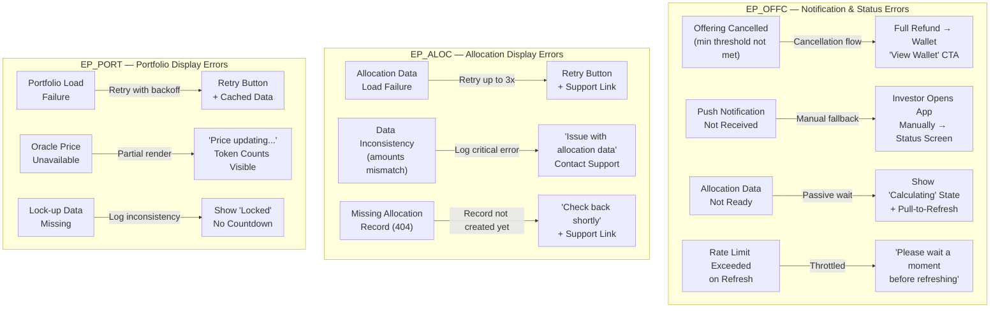

## Overview

- Codename: `JB_SETTLE`
- Job statement: "As an investor, I want to receive and manage my tokens so that I can track my real estate investment"
- Role: `RL_INV`
- Phases: OSET
- Epics: `EP_OFFC` (Offering Closure Notification), `EP_ALOC` (Allocation Result), `EP_PORT` (Portfolio)
- Wireframe screens: 4 screens in `investor/oset/`
- Entry point: After commitment confirmed (`JB_INVEST` complete, `EP_CONF` status = CONFIRMED)
- Exit point: Portfolio view (`EP_PORT`), future transfer/redemption (`UF_XFER`)

### Epic Summary

Epics in JB_SETTLE

#### Epic Table

| Epic | Features | Description |
|------|----------|-------------|
| `EP_OFFC` — Offering Closure Notification | FT_ENDN (End Notification) FT_PROC (Processing Status) | Push notification when Token Offering ends (scheduled or admin close). Processing status screen with "Calculating allocation" indicator, estimated timeline, and pull-to-refresh. Passive waiting — no transactional user action. |
| `EP_ALOC` — Allocation Result | FT_ALSC (Allocation Screen) FT_BRKD (Breakdown Display) FT_CANC (Cancellation Screen) | Push notification when tokens are allocated (success) or offering cancelled (failure). Allocation result screen with committed vs allocated breakdown, subscription demand, allocation ratio, refund amount. Cancellation screen with reason, full refund, and "View Wallet" CTA. |
| `EP_PORT` — Portfolio | FT_PFSC (Portfolio Screen) FT_TBAL (Token Balance Card) | Portfolio screen showing total value, token count, project count, available balance (with oversubscription refund note if applicable). Token balance cards per-project with token count, current value, change `%`, lock-up countdown. Read-only in OSET phase. |

---

## Happy Path Flow

### Settlement & Portfolio Journey

End-to-end settlement flow from offering close to portfolio

#### Diagram

```mermaid
%%{init: {'themeCSS': '.section, .actor, .messageText, .title, text, .taskText, .cluster text { font-size: 24px !important; } .mermaid { zoom: 1.6; }','themeVariables': {'fontSize': '24px'}  } }%%
flowchart LR
    subgraph EP_OFFC["EP_OFFC — Offering Closure Notification"]
        A["Status Tracking<br/><code>investor/toko/status-tracking.html</code>"]
        B["Push Notification<br/>'Offering has ended'"]
        C["Status Screen<br/>'Calculating allocation'"]
        A -->|"Campaign ends"| B
        B -->|"Tap notification"| C
        C -->|"Pull-to-refresh"| C
    end

    subgraph EP_ALOC["EP_ALOC — Allocation Result"]
        D["Push Notification<br/>'Tokens allocated!'"]
        E["Allocation Result<br/><code>investor/oset/allocation-result.html</code>"]
        F["Payment Breakdown<br/><code>investor/oset/payment.html</code>"]
        G["Token Receipt<br/><code>investor/oset/token-receipt.html</code>"]
        D -->|"Tap notification"| E
        E --> F
        F --> G
    end

    subgraph EP_PORT["EP_PORT — Portfolio"]
        H["Portfolio<br/><code>investor/oset/portfolio.html</code>"]
        I["Token Balance Cards<br/>Per-project holdings"]
        H --> I
    end

    C -->|"Allocation complete"| D
    G -->|"'View Portfolio' CTA"| H
    I -->|"Future"| J["UF_XFER.EP_PORT<br/>Ongoing Monitoring"]
```

#### Screen Mapping Table

| Node | Screen Label | Wireframe Path | Epic | Feature |
|------|-------------|----------------|------|---------|
| A | Status Tracking | `investor/toko/status-tracking.html` | `EP_CONF` (bridge) | FT_STAT |
| B | Push Notification (offering ended) | — (OS push) | `EP_OFFC` | FT_ENDN |
| C | Status Screen (calculating) | — (in-app status) | `EP_OFFC` | FT_PROC |
| D | Push Notification (allocated) | — (OS push) | `EP_ALOC` | FT_ALSC |
| E | Allocation Result | `investor/oset/allocation-result.html` | `EP_ALOC` | FT_ALSC |
| F | Payment Breakdown | `investor/oset/payment.html` | `EP_ALOC` | FT_BRKD |
| G | Token Receipt | `investor/oset/token-receipt.html` | `EP_ALOC` | FT_ALSC |
| H | Portfolio | `investor/oset/portfolio.html` | `EP_PORT` | FT_PFSC |
| I | Token Balance Cards | `investor/oset/portfolio.html` (section) | `EP_PORT` | FT_TBAL |

---

## Decision Points

### Key Branching Logic

Decision points across EP_OFFC, EP_ALOC, EP_PORT

#### Decision Table

| Decision Point | Condition | True Path | False Path |
|---------------|-----------|-----------|------------|
| Settlement result | `status` = `ALLOCATION_COMPLETE` | Success — push notification "Tokens allocated!", allocation result screen with breakdown | Failure — push notification "Offering cancelled", cancellation screen with full refund |
| Oversubscribed? | `totalDemand` `>` `totalSupply` | Pro-rata allocation: `allocationRatio` `<` `100%`, partial refund to VPay wallet | Full allocation: `allocationRatio` = `100%`, refund = `0` VND |
| Campaign status | `CALCULATING` / `ALLOCATION_COMPLETE` / `CANCELLED` | `CALCULATING` — show processing status screen with indicator | `ALLOCATION_COMPLETE` — auto-transition to EP_ALOC; `CANCELLED` — show cancellation screen with "View Wallet" CTA |
| Push permission granted? | Device has push notification permission enabled | Deliver push notification via OS push service | Log as `SKIPPED`; investor sees status on next app open (in-app fallback) |
| Rate limit on pull-to-refresh | Last refresh `<` 10 seconds ago | Throttle — show "Please wait a moment before refreshing"; no API call | Allow — call `GET /campaigns/{campaignId}/status` and refresh screen |
| Lock-up applicable? | `lockUpDays` is not null | Display lock icon with countdown ("Locked — 90 days remaining") | Display "Tokens available for transfer immediately" |
| Refund exists? | `refundAmount` `>` `0` | Show refund amount with status ("Already credited") and "From oversubscription refund" note in portfolio | Show "Refund: `0` VND" with note "Your full commitment was allocated" |
| Oracle price stale? | `lastUpdate` `>` 5 minutes ago | Show last known price with "Price updating..." indicator | Show current price normally |

---

## Error Paths

### Error Recovery Flows

Error scenarios and recovery actions

#### Error Diagram

#### Recovery Table

| Error | Trigger | Recovery Action | Epic |
|-------|---------|-----------------|------|
| Offering cancelled | Total demand `<` threshold K (undersubscription failure) | Full refund to VPay wallet; show cancellation screen with reason and "View Wallet" CTA; no tokens minted | `EP_ALOC` |
| Push notification not received | Device offline, push permission denied, or delivery failure | Investor opens app manually; status screen accessible without notification; retry with exponential backoff (up to 3 retries) | `EP_OFFC` |
| Allocation data not ready | Investor views status before settlement completes | Show "Calculating allocation" with animated indicator; pull-to-refresh enabled; auto-transition when `ALLOCATION_COMPLETE` | `EP_OFFC` |
| Rate limit exceeded on refresh | Pull-to-refresh within 10 seconds of last refresh | Show "Please wait a moment before refreshing"; no API call; existing data remains displayed | `EP_OFFC` |
| Allocation data load failure | HTTP 5xx or network timeout on `GET /allocations/{userId}/{campaignId}` | Show "Unable to load allocation data" with "Retry" button; after 3 retries show "Check back shortly" with support link | `EP_ALOC` |
| Data inconsistency | `amountCharged` + `refundAmount` != `commitmentAmount` | Log critical error; show "Issue with allocation data — Contact Support"; do not display raw data | `EP_ALOC` |
| Missing allocation record | 404 on allocation API (record not yet created) | Show "Allocation result not available yet. Check back shortly." with support link | `EP_ALOC` |
| Portfolio load failure | HTTP 5xx or network timeout on `GET /portfolio/{userId}` | Show "Unable to load portfolio" with "Retry" button; display cached data if available with "Data may be outdated" label | `EP_PORT` |
| Oracle price unavailable | Price service down (503) | Show token counts and lock-up status; value fields show "Price updating..."; pull-to-refresh available | `EP_PORT` |
| Lock-up data missing | `lockupEndDate` = null but `lockupStatus` = `LOCKED` | Show "Locked" without countdown; log data inconsistency for investigation | `EP_PORT` |
| Processing exceeds expected timeline | `estimatedCompletionTime` has passed, status still `CALCULATING` | Show "Taking longer than expected. We're still working on it." with "Contact Support" link | `EP_OFFC` |

---

## Cross-Role Interactions

### System Sequence

Cross-role flow from campaign close to portfolio view

#### Sequence Diagram

```mermaid
%%{init: {'themeCSS': '.section, .actor, .messageText, .title, text, .taskText, .cluster text { font-size: 24px !important; } .mermaid { zoom: 1.6; }','themeVariables': {'fontSize': '24px'}  } }%%
sequenceDiagram
    participant ADM as RL_ADM<br/>Admin
    participant SRV as Settlement<br/>Service
    participant EB as Event Bus
    participant BE as VPay<br/>Backend
    participant APP as VPay<br/>App
    participant INV as RL_INV<br/>Investor

    Note over ADM, INV: EP_OFFC — Offering Closure Notification

    ADM->>SRV: Close campaign (scheduled or manual)
    SRV->>SRV: Update campaign status → CLOSED
    SRV->>EB: Publish offering.ended event
    EB->>BE: Forward offering.ended event
    BE->>BE: Query investors with CONFIRMED commitments
    BE->>APP: Push notification: "Token Offering has ended"
    APP-->>INV: Display notification
    INV->>APP: Tap notification
    APP->>BE: GET /campaigns/{campaignId}/status
    BE-->>APP: Status: CALCULATING
    APP-->>INV: Display processing status screen

    Note over ADM, INV: Admin Settlement (EP_CALC → EP_PREV → EP_EXEC)

    ADM->>SRV: Run allocation calculation
    SRV->>SRV: Calculate pro-rata allocation (if oversubscribed)
    ADM->>SRV: Preview settlement results
    ADM->>SRV: Execute settlement

    Note over ADM, INV: EP_ALOC — Allocation Result

    SRV->>EB: Publish allocation.completed event
    EB->>BE: Forward allocation.completed
    BE->>APP: Push notification: "Your tokens have been allocated!"
    APP-->>INV: Display notification
    INV->>APP: Tap notification
    APP->>BE: GET /allocations/{userId}/{campaignId}
    BE-->>APP: Allocation result (tokens, breakdown, refund)
    APP-->>INV: Display allocation result screen
    INV->>APP: View breakdown (committed vs allocated vs refund)

    Note over ADM, INV: EP_PORT — Portfolio

    INV->>APP: Tap "View Portfolio" CTA
    APP->>BE: GET /portfolio/{userId}
    BE-->>APP: Portfolio data (tokens, values, lock-up)
    APP-->>INV: Display portfolio with token balance cards
```

---

## References

### Source Documents

PRD and wireframe references

#### PRD Links

- [EP_OFFC — Offering Closure Notification (OSET)](../../../nghia_po_proposal/prd/rp2511_e50_sseq_oset_ep_offc.md)
- [EP_ALOC — Allocation Result Display (OSET)](../../../nghia_po_proposal/prd/rp2511_e50_sseq_oset_ep_aloc.md)
- [EP_PORT — Portfolio Update (OSET)](../../../nghia_po_proposal/prd/rp2511_e50_sseq_oset_ep_port.md)

#### Wireframe Links

- Ownership Settlement (OSET):
  - ../../investor/oset/allocation-result.html
  - ../../investor/oset/payment.html
  - ../../investor/oset/token-receipt.html
  - ../../investor/oset/portfolio.html
- Bridge from Token Offering (TOKO):
  - ../../investor/toko/status-tracking.html

