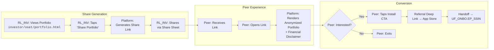
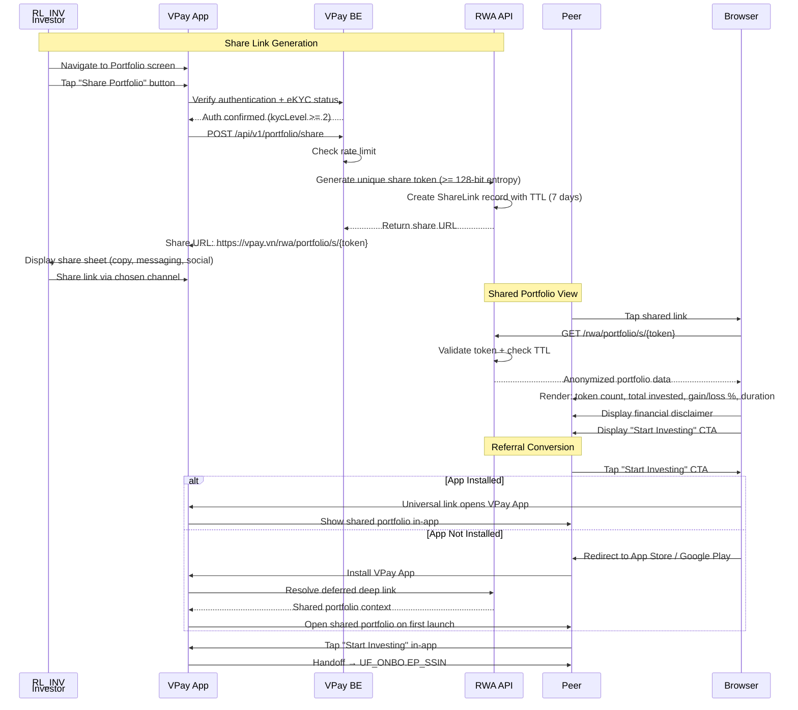

## Overview

- Codename: `JB_SHARE`
- Job statement: "As an investor, I want to share and promote my investments so that peers can see my success and join the platform"
- Role: `RL_INV`
- Phases: DISC
- Epics: `EP_SOCV` (Social Validation)
- Wireframe screens: No dedicated screens yet (uses portfolio from `investor/oset/portfolio.html`)
- Entry point: Portfolio screen (`JB_SETTLE`)
- Exit point: Peer onboarding (`JB_READY` for the new user)

### Epic Summary

EP_SOCV features overview

#### Feature Table

| Epic | Feature | Description |
|------|---------|-------------|
| `EP_SOCV` | Shareable Portfolio | - Investor generates a unique share link from the portfolio screen - Link contains a cryptographically random token (`>=` 128-bit entropy) - URL format: `https://vpay.vn/rwa/portfolio/s/{token}` - Share links have TTL (default 7 days) - Max 10 active share links per investor |
| `EP_SOCV` | Anonymized View | - Shared view displays: token count, total invested, gain/loss `%`, duration - Shared view does NOT display: name, wallet address, phone, email, transaction history - Financial disclaimer must be visible on shared view |
| `EP_SOCV` | Referral Deep Link | - Peer opens shared link in browser or app - If app installed: universal link opens VPay App directly - If app not installed: redirect to App Store / Google Play - Deferred deep link opens shared portfolio on first launch - Install CTA hands off to `UF_ONBO.EP_SSIN` |

---

## Happy Path Flow

### Social Sharing Journey

End-to-end social sharing flowchart

#### Diagram

#### Screen Mapping Table

- No dedicated wireframe screens exist yet for `JB_SHARE`
- The following screens are referenced from other JTBDs or are pending wireframe design

| Step | Screen Label | Wireframe Path | Status |
|------|-------------|----------------|--------|
| Portfolio entry point | Portfolio | `investor/oset/portfolio.html` | Exists (from `JB_SETTLE`) |
| Share button / share sheet | Share Portfolio | Pending wireframe design | Not yet created |
| Anonymized portfolio view | Shared Portfolio View | Pending wireframe design | Not yet created |
| App store redirect | Install CTA | Pending wireframe design | Not yet created |
| Peer onboarding handoff | VPay Entry | `investor/onbo/vpay-entry.html` | Exists (from `JB_READY`) |

---

## Decision Points

### Key Branching Logic

Decision points in the social sharing flow

#### Decision Table

| Decision Point | Condition | True Path | False Path |
|---------------|-----------|-----------|------------|
| Authenticated? | Investor has active VPay session | Proceed to share link generation | Redirect to VPay Sign-In |
| eKYC completed? | `kycLevel` `>=` 2 | Allow share generation | Show message: complete eKYC first |
| Rate limit OK? | Share generation not rate-limited | Generate unique share token | Display: "Please wait before generating another link" |
| Max active links (`>` 10)? | Investor has `>` 10 active share links | Revoke oldest link, then generate new | Generate new link normally |
| App installed on peer device? | Universal link resolves to installed app | Open VPay App directly via universal link | Redirect to App Store / Google Play |
| Peer interested? | Peer taps "Start Investing" CTA | Handoff to `UF_ONBO.EP_SSIN` | Peer closes view |
| Share link expired? | Current time `>` link creation time + TTL | Show "Portfolio no longer available" | Render anonymized portfolio view |

---

## Error Paths

### Error Recovery Flows

Error handling for social sharing

#### Error Diagram

```mermaid
%%{init: {'themeCSS': '.section, .actor, .messageText, .title, text, .taskText, .cluster text { font-size: 24px !important; } .mermaid { zoom: 1.6; }','themeVariables': {'fontSize': '24px'}  } }%%
flowchart TD
    subgraph AuthErrors["Authentication Errors"]
        E1["Not Authenticated"]
        E1R["Redirect to VPay Sign-In"]
        E1 -->|"Sign in required"| E1R
    end

    subgraph RateErrors["Rate Limit Errors"]
        E2["Rate Limit Exceeded"]
        E2R["Display: 'Please wait<br/>before generating another link'"]
        E2 -->|"Cooldown period"| E2R
    end

    subgraph PortfolioErrors["Portfolio Errors"]
        E3["Zero Balance Portfolio"]
        E3R["Empty State Message:<br/>'No investments to share yet'"]
        E3 -->|"Nothing to share"| E3R
    end

    subgraph LinkErrors["Share Link Errors"]
        E4["Expired Share Link"]
        E4R["Display: 'Portfolio no longer available'<br/>+ Install CTA"]
        E4 -->|"TTL exceeded"| E4R
    end

    subgraph DeepLinkErrors["Deep Link Errors"]
        E5["Deferred Deep Link Failure"]
        E5R["Show App Home Instead"]
        E5 -->|"Fallback to home"| E5R
    end
```

#### Recovery Table

| Error | Trigger | Recovery Action |
|-------|---------|-----------------|
| Not authenticated | Investor session expired or not logged in | Redirect to VPay Sign-In; return to portfolio after auth |
| Rate limit exceeded | Too many share link generation requests in short period | Display cooldown message; auto-retry after cooldown expires |
| Zero balance portfolio | Investor has no token holdings to share | Show empty state with message "No investments to share yet"; suggest browsing projects |
| Expired share link | Peer opens link after TTL (default 7 days) has passed | Show "Portfolio no longer available" message with Install CTA as fallback |
| Deferred deep link failure | Deep link parameters lost during app install process | Show app home screen instead of shared portfolio; peer can still onboard normally |
| Share link generation failure | API error on `POST /api/v1/portfolio/share` | Show error toast with manual retry button; use idempotency key for retry |
| Max active links reached | Investor already has 10 active share links | Prompt to revoke oldest link or deny generation with message |

---

## Cross-Role Interactions

### System Sequence

RL_INV, VPay, RWA API, and Peer interactions

#### Sequence Diagram

---

## References

### Source Documents

PRD and wireframe references

#### PRD Links

- [EP_SOCV — Social Validation (DISC)](../../../nghia_po_proposal/prd/rp2511_e46_sseq_disc_ep_socv.md)

#### Wireframe Links

- ../../investor/oset/portfolio.html — entry point for sharing
- Note: Dedicated share screens pending wireframe design

