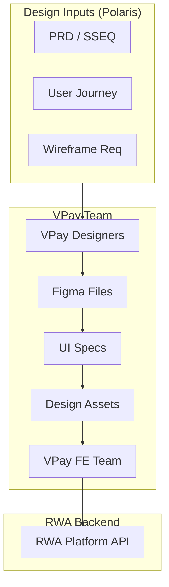
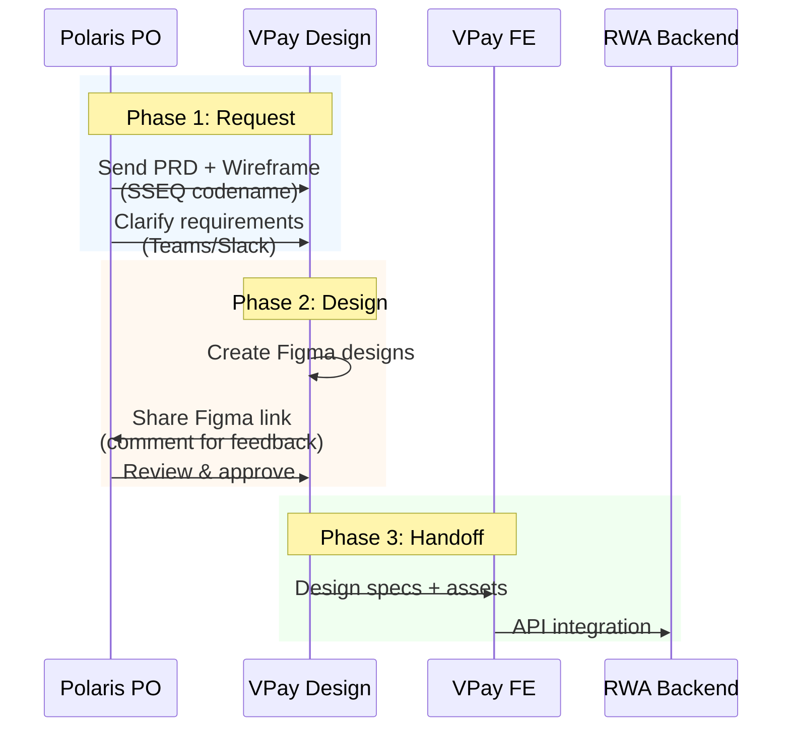
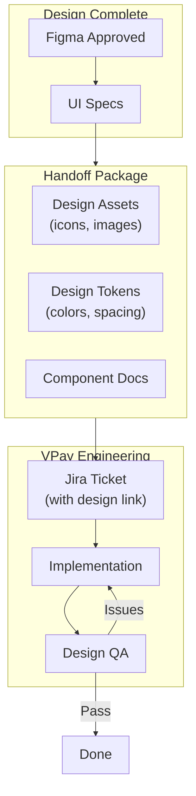

# UI/UX Design Flow

## General Info

### Purpose

This document describes the UI/UX design workflow for the RWA project, covering:
- Communication with VPay design team (external)
- Handoff process to VPay engineering for implementation

### Scope

- This workflow covers **Investor role (`RL_INV`)** UI/UX only
- VPay Design Team owns all Investor-facing screens in VPay App

### System Architecture



### Team Responsibilities

| Team | Scope | Frontend | Tools |
|------|-------|----------|-------|
| **VPay Design** | `RL_INV` screens | VPay App (Flutter) | Figma |

### Referenced Files

| Category | File | Description |
|----------|------|-------------|
| **Product Flow** | `rp2511_a48_product_flow.md` | PRD creation and wireframe workflow |
| **User Journey** | `rp2511_e05_ujrn_investor.md` | Investor user journey |
| **Wireframe Output** | `wireframes/investor/` (repo02) | Investor wireframes |

---

## Design Ownership

### Ownership Matrix

| Role | Frontend | Design Owner | Implementation Owner |
|------|----------|--------------|---------------------|
| `RL_INV` | VPay App (mobile) | **VPay Design Team** | VPay FE Team |

### Contact Points

| Team | Role | PIC | Responsibility |
|------|------|-----|----------------|
| **VPay Design** | Design Lead | Huy Kieu | Investor app UI/UX decisions |
| **Polaris** | PO | Nghia Nguyen | Requirements, PRD, wireframes |
| **Polaris** | Tech Lead | Kyle | API specs, design-to-code coordination |
| **VPay FE** | FE Lead | TBD | Investor app implementation |

### Timeline

| Milestone | Deadline | Owner | Status |
|-----------|----------|-------|--------|
| PRD + Wireframes ready | 2026-02-28 | Polaris PO | 🟡 In Progress |
| Figma designs ready | **2026-03-06** | VPay Design | 🔴 Pending |
| Design review & approval | 2026-03-07 | Polaris PO | 🔴 Pending |
| Handoff to VPay FE | 2026-03-08 | VPay Design | 🔴 Pending |

**Key Deadline:** UI/UX materials on Figma must be ready before **March 6, 2026**.

---

## Communication with VPay Design Team

### Overview

- VPay Design Team owns all `RL_INV` (Investor) UI/UX
- Polaris provides requirements via PRD and wireframes
- VPay delivers Figma designs for implementation

### Communication Flow



### Request Process

| Step | Actor | Action | Deliverable |
|------|-------|--------|-------------|
| **1. Prepare PRD** | Polaris PO | Create PRD with SSEQ codename | `SSEQ(UF_XXXX.EP_YYYY) (RL_INV)` |
| **2. Create Wireframe** | Polaris | Create basic wireframe (optional) | `wireframes/investor/{phase}/` |
| **3. Submit Request** | Polaris PO | Send request via Teams/Jira | Request ticket + PRD link |
| **4. Kickoff Meeting** | Both | Clarify requirements | Meeting notes |

### Request Template

```markdown
## Design Request: [SSEQ Codename]

**SSEQ:** SSEQ(UF_XXXX.EP_YYYY) (RL_INV)
**Phase:** [ONBO/TOKO/OSET/etc.]
**Priority:** [P0/P1/P2/P3]

### Requirements
- [User story 1]
- [User story 2]

### References
- PRD: [link to PRD doc]
- Wireframe: [link to wireframe if available]
- API Spec: [link to API spec]

### Screens Needed
| Screen | Description |
|--------|-------------|
| [screen-1] | [description] |
| [screen-2] | [description] |

### Timeline
- Request Date: YYYY-MM-DD
- Expected Delivery: YYYY-MM-DD
```

### Review & Feedback Process

| Step | Actor | Action | Channel |
|------|-------|--------|---------|
| **1. Share Draft** | VPay Design | Share Figma link | Teams |
| **2. Add Comments** | Polaris PO | Comment directly in Figma | Figma |
| **3. Review Meeting** | Both | Walk through designs (if needed) | Teams call |
| **4. Approve** | Polaris PO | Mark as approved in Figma | Figma |
| **5. Notify** | VPay Design | Notify VPay FE for implementation | Teams/Jira |

### Communication Channels

| Purpose | Channel | Participants |
|---------|---------|--------------|
| **Design requests** | Jira / Teams | PO, Design Lead |
| **Quick questions** | Teams/Slack DM | PO, Designer |
| **Design review** | Figma comments | PO, Designer, Tech Lead |
| **Formal meetings** | Teams call | All stakeholders |

---

## Design-to-Engineering Handoff

### Overview

- Design handoff is the process of transferring finalized designs to VPay FE for implementation
- Polaris provides API specs for integration

### Handoff Flow



### Handoff Checklist

| Item | Owner | Description |
|------|-------|-------------|
| **Figma Link** | VPay Designer | Final approved Figma file |
| **UI Specs** | VPay Designer | Component specs, spacing, colors |
| **Assets** | VPay Designer | Icons, images (exported) |
| **API Mapping** | Polaris PO | Screen-to-API endpoint mapping |
| **Jira Ticket** | VPay PO | Implementation ticket with design link |
| **Acceptance Criteria** | Polaris PO | Testable criteria from PRD |

### Jira Ticket Template

```markdown
## [SSEQ Codename] - [Screen Name]

**Type:** Story
**Epic:** [Epic link with SSEQ codename]

### Description
Implement [screen name] as per design specifications.

### Design
- Figma: [link]
- UI Specs: [link]

### API Endpoints
| Action | Endpoint | Notes |
|--------|----------|-------|
| [action] | `GET /v1/...` | [notes] |

### Acceptance Criteria
- [ ] [Criterion 1]
- [ ] [Criterion 2]
- [ ] Design QA passed
```

### Design QA Process

| Step | Actor | Action |
|------|-------|--------|
| **1. Self-review** | VPay FE Developer | Compare implementation to Figma |
| **2. Request QA** | VPay FE Developer | Move ticket to "Ready for Design QA" |
| **3. Design QA** | VPay Designer / PO | Review implementation vs design |
| **4. Log Issues** | VPay Designer / PO | Comment on Jira ticket |
| **5. Fix & Re-QA** | VPay FE Developer | Fix issues, request re-QA |
| **6. Approve** | VPay Designer / PO | Mark design QA passed |

### Common QA Checkpoints

| Category | Check |
|----------|-------|
| **Layout** | Spacing, alignment, responsive behavior |
| **Typography** | Font family, size, weight, line height |
| **Colors** | Brand colors, contrast, hover/active states |
| **Components** | Correct Flutter components used |
| **Interactions** | Tap, swipe, loading, error states |
| **Content** | Copy matches design, truncation behavior |

---

## Folder Structure

### Design Assets Location

```
repo02: docs/com_vin_fin_mod/prj_rwa/rp2511/
├── wireframes/                    # Wireframes (HTML prototypes)
│   ├── investor/                  # RL_INV screens
│   │   ├── onbo/                  # UF_ONBO screens
│   │   ├── preo/                  # UF_PREO screens
│   │   ├── toko/                  # UF_TOKO screens
│   │   ├── oset/                  # UF_OSET screens
│   │   ├── xfer/                  # UF_XFER screens
│   │   └── redm/                  # UF_REDM screens
│   └── references/
│       └── vpay-screenshots/      # VPay reference screenshots
│
├── designs/                       # Finalized designs
│   ├── figma-links.md             # Master list of Figma links
│   └── assets/                    # Exported design assets
│       ├── icons/
│       └── images/
```

### Figma Organization

```
Figma Project: RWA Platform
└── Investor App (VPay)           # Owned by VPay Design
    ├── ONBO - Onboarding
    │   ├── Sign Up
    │   ├── eKYC
    │   └── Wallet Setup
    ├── TOKO - Token Offering
    │   ├── Offering List
    │   ├── Offering Details
    │   └── Subscribe Flow
    ├── OSET - Settlement
    │   ├── Allocation Result
    │   └── Token Receipt
    ├── XFER - Transfer
    │   ├── Transfer Out
    │   └── Transfer In
    ├── REDM - Redemption
    │   ├── Redemption Request
    │   └── Unit Selection
    └── Design System
        ├── Colors
        ├── Typography
        └── Components
```

---

## Quick Reference

### Communication Summary

| Scenario | Channel | Template |
|----------|---------|----------|
| **Request design** | Jira + Teams | Design Request Template |
| **Design feedback** | Figma comments | Direct comments on design |
| **Quick questions** | Teams/Slack | DM to designer |
| **Formal review** | Teams call | Calendar invite |
| **Handoff to engineering** | Jira | Jira Ticket Template |

### Workflow Summary

```
Polaris PO → VPay Design → VPay FE → RWA Backend API
```

| Step | Owner | Output |
|------|-------|--------|
| **1. Requirements** | Polaris PO | PRD + Wireframe |
| **2. Design** | VPay Design | Figma + UI Specs |
| **3. Implementation** | VPay FE | Flutter screens |
| **4. Integration** | VPay FE + RWA BE | API integration |

### Design Request Checklist

- [ ] SSEQ codename assigned: `SSEQ(UF_XXXX.EP_YYYY) (RL_INV)`
- [ ] PRD completed with acceptance criteria
- [ ] Wireframe created (optional but recommended)
- [ ] API spec available (for data-driven screens)
- [ ] Priority and timeline communicated
- [ ] Request submitted via Jira/Teams

### Design Handoff Checklist

- [ ] Figma design approved by Polaris PO
- [ ] UI specs documented
- [ ] Assets exported (icons, images)
- [ ] Jira ticket created with design link
- [ ] API mapping included
- [ ] Acceptance criteria defined
- [ ] Designer available for QA

---

## Escalation

| Issue | Escalate To | Channel |
|-------|-------------|---------|
| **Design delays** | VPay Design Lead | Teams |
| **Design quality issues** | Polaris Tech Lead → VPay Design Lead | Teams |
| **API integration blockers** | Both Tech Leads | Teams call |
| **Scope changes** | Polaris PO + VPay PO | Jira + Meeting |
